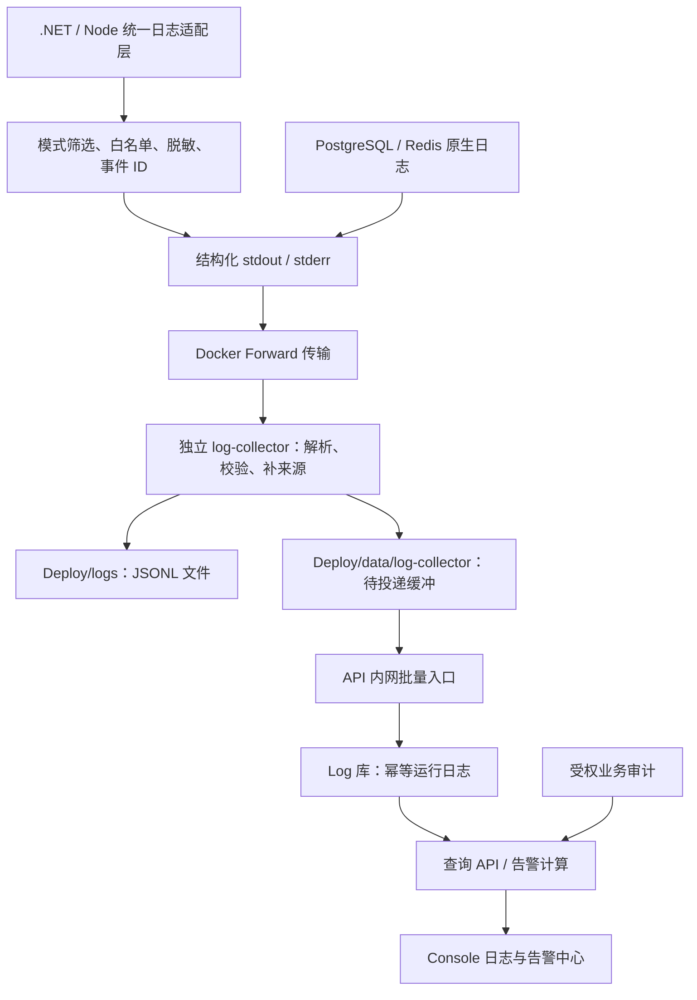

# 全项目统一日志、跨容器汇聚与 Console 运维中心

> 状态：项目所有者已于 2026-09-19 确认方案；作为重构基线，运行时实现尚未开始。
>
> 更新：2026-09-19（Asia/Shanghai）。范围来自项目所有者本轮反馈：统一文件、终端和日志库，开发 / 生产两种模式，Info / Warning / Error 三级，跨服务容器集中查询，Console 内告警与提醒。

本文是本次重构的设计入口；代码现状与迁移清单见[日志现状审计](./unified-logging-inventory.md)。现有实现仍以[日志系统](../guide/logging.md)及其代码为准，不能把本文目标当作已上线功能。专题不改变既有发布、生产部署和服务启动授权边界。

## 1. 结论与目标

采用“统一事件、统一策略、集中分发、统一查询”的架构。业务记录一次事件，文件、终端、日志库使用同一事件 ID、级别、时间和安全内容；区别仅在编码、保留期和展示方式。

推荐增加一个独立 `log-collector` 容器，候选实现为 Fluent Bit；生产宿主只输出结构化标准流，采集端统一写 JSONL 文件，并经 API 的内网批量入口写入 Log 数据库。Console 只调用统一日志查询 API。采集器不依赖 API / PostgreSQL 健康才能接收及写文件。

设计要同时满足：

1. API、Auth、Gateway、DbMigrate、前端静态服务、PostgreSQL、Redis 的日志在同一入口筛选。
2. 正常生产运行不持续输出 SQL 参数、逐方法调用、无工作量轮询和完整用户载荷。
3. Development 与 Production 使用同一事件契约和三个等级，开发模式增加安全诊断细节。
4. 文件与数据库记录可通过事件 ID 对账；传输重试不扩大应用事件数量与告警次数。
5. 数据库不可用时文件仍可排障，缓冲恢复后能补写；容量有限时明确暴露缺口。
6. 持久日志、缓冲、告警状态及配置纳入 `Deploy/` 的备份范围。

“统一”指一套处理链和一个日常查询入口，不代表所有进程共写一个文件、每条日志保存三份正文，或所有业务审计都改用异步日志传输。

## 2. 现状与根因

| 现状 | 根因与影响 | 重构方向 |
| --- | --- | --- |
| `AddSerilogSetup` 供三个 Web 宿主复用，但各自扇出终端、文件、数据库 | 同一事件在各宿主重复承担持久化；Gateway 又没有注册 SQLSugar 日志写入依赖 | 宿主负责生成事件；采集端与入库入口负责持久化 |
| `SqlAopLog` 默认生成所有 CRUD 日志，普通 SQL 使用 Information | 成功请求也产生多行 SQL 和参数，慢查询又受相同开关控制 | 普通 SQL 为开发诊断；慢查询独立启用，只记录安全摘要 |
| Service AOP、事务、Auth seed、DbMigrate、Rust FFI 有直接终端输出 | 级别、格式、脱敏与收敛规则存在旁路 | 逐类接入适配层，保留必要的 CLI 结果协议 |
| SQLSugar、Service AOP、API 异常处理可能重复记录一个失败 | 缺少异常记录责任边界 | 最终处理 / 放弃重试的一层记录 Error，其余补上下文 |
| 审计写库后再次生成普通应用日志 | 业务证据和运行诊断混用 | 审计权威记录独立；运行视图只保存受控摘要与引用 |
| Information / Warning / Error 分模型分表，SQL 又另有表 | 全服务查询和级别切换缺少统一模型 | 新运行日志表使用 Level 字段；按时间治理存储 |
| 全局脱敏只覆盖部分字符串查询参数 | 嵌套对象、异常文本、表单和业务正文不一定受保护 | 先限制允许记录的内容，再统一防御性脱敏 |
| 文件只有数量保留配置，SelfLog 和日志库缺少完整容量治理 | 级别降低也不能阻止长期磁盘增长 | 文件、缓冲、数据库分别设置空间与时间边界 |

这些结论来自仓库静态审计；没有读取服务器配置，也不能据此判断线上普通 Serilog 入库开关是否开启。通用审计本身就有独立入库路径。

## 3. 范围与职责

| 日志来源 | 本专题处理 | 特殊边界 |
| --- | --- | --- |
| API / Service / Repository / Infrastructure | 统一结构化入口、来源、事件编码、异常所有者 | 不为查询日志引入业务依赖倒流 |
| Auth / Gateway | 同一启动与运行策略、安全认证摘要、请求关联 | 禁止记录 OAuth code、完整 returnUrl 和令牌 |
| DbMigrate / seed | 引导期日志与迁移阶段摘要接入 | `doctor / verify` 报告和退出码是命令结果，不能被采集格式破坏 |
| Node 前端静态服务 | JSON 事件、三级、路径与异常安全摘要 | 当前镜像运行 Node `serve-static.mjs`，不是 Nginx |
| PostgreSQL / Redis | 采集容器标准流，按来源解析原生等级 | 不启用全量 SQL statement、参数或 Redis MONITOR |
| 部署脚本、入口脚本、外部 Nginx | 检查密钥回显，关键结果可转换成事件；提供外部接入说明 | 非 Compose 管理的服务不宣称已自动接入 |
| Web Client / Console / `@radish/http` | 统一三级与安全规则，复用公共日志实现 | 浏览器运行在用户设备，容器采集不到；首期不自动上传用户浏览器日志 |
| Flutter Native / Rust FFI | 明确日志入口及安全边界，消除重复裸输出 | Flutter 设备日志不自动回传；Rust 错误由宿主边界负责记录 |
| 领域审计 / 余额流水 / 治理证据 | 统一入口中提供受权审计视图与关联 | 权威事实、事务、租户及保留规则独立，不能被采样或普通日志清理删除 |

首期集中的是当前单机 Compose 服务；跨主机扩展沿用事件契约，另加每机采集器及受认证的加密转发。首期不引入 Elasticsearch、Loki、Grafana 或完整指标 / 链路平台。

## 4. 统一链路与三种介质



- **生成入口**：.NET 统一使用 `ILogger<T>` / 标准结构化事件；Serilog 作为一个 provider，由 `Radish.Extension.Log` 统一注册。移除业务层对具体 sink 的知识，现有 Serilog 调用分批迁移，不能长期维持两套策略。
- **处理策略**：应用在第一次输出前完成模式筛选和脱敏；采集端给容器原生日志做适配，并校验应用事件。相同来源只接入一条采集路径。
- **终端**：生产输出单行 JSON，开发终端可格式化同一事件。终端呈现不再绕过策略。采集容器不把收到的所有业务事件再次输出到自身 stdout，避免二次复制与回环。
- **文件**：采集端集中拥有 JSONL 文件写权限，按服务 / 时间切片便于恢复；不能让多个宿主争写同一文本文件。文件保存规范化事件，不另写一份未经处理的 raw payload。
- **数据库**：内网入口是运行日志唯一数据库写入所有者；文件和数据库共享核心事件。入库时间、存储 ID 等属于介质元数据，不改变原事件。
- **查询**：Console 只查服务端数据库投影。数据库不可用时明确显示不可用，不能返回空列表冒充“没有错误”。文件是离线排障 / 显式补录入口，网页不直接读取服务器任意路径。

### 4.1 采集技术选择

| 路径 | 评价 | 本方案决策 |
| --- | --- | --- |
| 每个宿主独立写三个 sink | 接入短，但无法覆盖容器原生输出，重复维护写入与恢复 | 退出生产目标架构 |
| 挂 Docker socket 拉日志 | 可枚举容器，但会扩大采集器对 Docker 守护进程的权限 | 首期不采用；只读挂载 socket 不等于只读 Docker API |
| Fluent Bit 接收 Forward，输出文件 + 内网 HTTP | 解耦存储与生产者，已有传输、缓冲和过滤能力 | 推荐，新增一个采集容器和 API 内网入口 |
| Fluent Bit 直接写 PostgreSQL | 有现成插件，但表格式、初始化依赖和重试去重需要额外适配 | 不作为首期默认，避免存储策略落到采集器插件里 |
| Vector / 专用日志存储 | 可替换采集或查询介质，但会增加本批选型变量 | 保留替换边界，不与推荐方案同时落地 |

Docker 提供 `fluentd` 日志驱动，Fluent Bit 提供相应 Forward 输入和 HTTP / 文件输出。这支持上述拓扑，但不等同于 Radish 已验证端到端可靠性。[Docker 驱动](https://docs.docker.com/engine/logging/drivers/fluentd/)、[Forward 输入](https://docs.fluentbit.io/manual/data-pipeline/inputs/forward)、[HTTP 输出](https://docs.fluentbit.io/manual/data-pipeline/outputs/http)。

Fluent Bit 的镜像版本、digest、目标架构、插件列表和许可证在 L1 验证后冻结，不使用浮动 `latest`。本次只选定技术方向，没有安装依赖或拉取 / 启动新镜像。

### 4.2 容器接入与启动顺序

1. Compose 对明确登记的服务设置日志驱动与来源标签，不改宿主 Docker 全局默认。
2. Linux 单机默认由 Docker daemon 连接宿主回环地址映射的 Forward 端口；不能把 Compose DNS 名当作 daemon 一定能解析的地址。Docker Desktop / rootless 需单独验证路径。
3. 采集器不挂载 Docker socket，不公开远程日志接收端口；本机接收端不作为多租户安全隔离机制，只信任受管理宿主。
4. collector 先启动接收和文件分发，PostgreSQL / DbMigrate 不依赖日志库写入成功；API 表结构仍由 DbMigrate 有序迁移建立。
5. Docker 使用异步连接及有限非阻塞缓冲，不能因采集器离线阻止数据库、迁移或业务容器启动。
6. API 可用后接收已缓存事件。collector 自身使用独立、有限的应急日志通道，不经自己的 Forward 输入自采集。
7. 生产切换需要重建受影响容器，使日志驱动变更生效；仅修改 `.env` 不代表现存容器已切换。

上述异步 / 非阻塞路径优先保障业务可用性，缓冲耗尽会丢日志，不能宣称绝不丢失。[Docker 投递模式](https://docs.docker.com/engine/logging/configure/)。

## 5. 开发 / 生产两种模式与三级日志

### 5.1 严重程度

| 规范等级 | 判断依据 | 示例 |
| --- | --- | --- |
| `Info` | 正常生命周期、明确状态变化、安全诊断 | 启动完成、迁移摘要、任务实际处理结果、开发诊断 |
| `Warning` | 需要关注但尚可继续，或预期能力降级 | 慢查询、依赖重试、受限资源、反复安全拒绝 |
| `Error` | 操作最终失败、功能不可用或进程即将退出 | 未处理异常、任务重试耗尽、依赖不可用、Fatal |

统一对外枚举为 `Info / Warning / Error`。`Warn / Information / Critical / Fatal` 在适配边界规范化；原始级别保留为受控元数据，Fatal 额外标记 `isFatal=true`，不增加第四个等级。

开发细节用 `diagnostic=true` 表示，不另建 Debug 等级。自有代码改为显式诊断事件；第三方 Debug / Trace / Verbose 在 Development 映射为 `Info + diagnostic`，在 Production 映射前丢弃。禁止先升级到 Info 再判断生产开关。

不是所有 4xx 都是 Warning：普通参数校验、取消请求、未找到资源等按业务语义处理；高频安全拒绝按规则聚合，不能让正常用户错误形成告警风暴。

### 5.2 模式矩阵

| 内容 / 行为 | Development | Production |
| --- | --- | --- |
| 生命周期与实际业务结果 | 精简 Info | 精简 Info |
| 方法过程、正常 SQL、框架请求细节 | 显式开启的诊断分类；仍有数量与大小限制 | 不生成 |
| SQL 参数值 | 不记录真实值；可看参数名、类型、数量及语句结构 | 不记录 |
| 慢 SQL / 执行失败 | 独立开关，安全摘要 | 默认开启，与普通 SQL 开关无关 |
| 无任务轮询、健康检查成功、缓存正常命中 | 默认安静，定位时按分类开启 | 不逐次记录 |
| Warning / Error | 保留必要上下文和受控堆栈 | 同样保留；不因生产模式一律隐藏堆栈 |
| 密码、令牌、正文、完整身份对象 | 禁止 | 禁止 |
| 告警 | 本地可验证规则，不向生产提醒 | Console 内提醒 |

`test-latest` 只是镜像轨道，不决定日志模式；公网测试部署仍使用 Production。Development 必须显式来自本地开发配置，生产部署拒绝开启开发诊断，不用一个可远程随意切换的 Debug 按钮绕过边界。

### 5.3 配置所有权

- 统一配置根拟定为 `RadishLogging`，包含 `Mode`、`MinimumLevel`、`Diagnostics`、`Capture`、`Limits`、`Retention`、`AlertRules`；旧 `Serilog.Console/File/Database` 和 `SqlAopLog` 散落开关按迁移表退出。
- 非敏感默认值放 `appsettings.Shared.json`，宿主只声明服务标识与必要差异，本地覆盖仍是 `appsettings.Local.json`；不新增另一套 appsettings 环境文件。
- Deploy `.env` 提供模式、路径、容量及内网采集凭据；collector 配置由同一已版本化策略生成 / 校验，不手写另一套相互冲突的级别规则。
- sink 只控制编码、目的地和生命周期，默认接收同一已筛选事件集；不再默认“文件 Error、数据库 Info、终端 Warning”造成三处语义不一致。
- 开发终端临时筛选是视图条件，不改变事件原始级别；存储关闭、入库延迟、保留期差异在查询状态中可见。

本地只运行单个宿主时允许“终端 + 本地 JSONL”的离线输出；需要全服务 Console 查询时启动同一采集链。SQLite 继续用于本地业务 / 审计与定向测试，不能为日志查询强制迁移业务数据库。是否启动采集链是运行拓扑选择，不增加第三种日志模式。

## 6. 统一事件契约

| 字段组 | 拟定字段与约束 |
| --- | --- |
| 身份 | `schemaVersion`、`eventId`、`eventCode`；eventId 是单条事件唯一 ID，eventCode 是稳定类别，二者不能混用 |
| 时间 | `occurredAtUtc`、`observedAtUtc`；入库另记 `ingestedAtUtc`，不覆盖事件发生时间 |
| 来源 | `deploymentId`、`service`、`instanceId`、`containerId`、`release`、`mode`、`sourceCategory` |
| 等级 | `level`、`diagnostic`、可选 `isFatal`；仅三级 |
| 关联 | `traceId`、`spanId`、`requestId`、`jobId`、`operationId`、可选权威 `tenantId` |
| 诊断 | `messageTemplate`、安全 `message`、白名单 `properties`、异常类型 / 错误码 / 受控栈帧 |
| 质量 | `normalizationStatus`、`redacted`、`truncated`；未解析来源不得伪造业务事件码 |

- 自有 .NET / Node 在输出前生成 UUID 事件 ID，重试沿用；第三方原生日志在第一次采集规范化时生成 ID，随后所有分发沿用。
- 对第三方在接收端之前发生的重发，没有可靠源序号时不能承诺精确去重；不能仅按“相同文本 + 秒”合并合法重复事件。告警聚合与存储去重分别处理。
- UTC 绝对时间遵循[时间语义](../guide/time-semantics.md)。缺失源时间时使用接收时间并标明来源，时钟偏移不改变告警计数的入库顺序。
- 关联使用 W3C trace 上下文及任务 operation ID；HTTP requestId 与 traceId 分开，不把 OAuth 凭据当跨服务关联键。登录重定向不自动等于一条连续分布式 trace。
- 单事件建议上限 32 KiB，消息 2 KiB，属性 32 个、嵌套深度 4，栈帧最多 32；截断字段带标识，不截成无效 JSON。这些是初始预算，L1 用代表载荷校准。
- 来源注册表只允许已知 service / category；请求输入不能覆盖部署、服务、级别或租户权威上下文。未知第三方行只保留来源、长度和安全解析失败摘要，不把原文直接放进日志库。

### 6.1 敏感信息治理

先治理调用点，再应用统一防御规则；不能把“前端隐藏详情”当成脱敏。

- 禁止凭据、连接字符串、Cookie / Authorization、认证返回对象、请求 / 响应正文、私聊和文档正文进入普通日志。
- 用户名、邮件、IP、UserAgent 等只按明确目的保留；普通诊断优先用受权标识，不默认解构实体。
- URL 只保留必要路由或无 query 路径；敏感字段规则同时覆盖 JSON、数组、表单、编码后的查询值和异常字符串。
- 不直接输出任意 `Exception.ToString()`；记录异常类型、已知错误码、安全说明及栈帧。第三方异常 message / data 不在白名单时省略。
- 开发模式同样不能输出真实敏感值。测试用标记秘密必须在终端、JSONL、入库、详情、复制和导出样本中均不可检出。
- PostgreSQL 错误 DETAIL、SQL statement、参数和 Redis 配置需在来源端关闭 / 裁剪；collector 之后的脱敏无法收回此前已进入 Docker 标准流缓存的原文。
- 旧日志按不可信历史数据处理，查询适配器再次裁剪；默认不批量导入历史原文，不自动删除既有证据。

### 6.2 异常与成功日志责任

| 场景 | 记录责任 |
| --- | --- |
| 最终未处理 HTTP 异常 | API / Auth / Gateway 的最终边界记录一次 Error；数据库层不再写同一堆栈 |
| 已处理的恢复 / 重试 | 作出恢复决定的组件记录必要 Warning / Info，带同一 operationId |
| 后台任务最终失败 | 任务执行边界记录 Error；重试中的失败与最终失败分事件码 |
| FFI 调用失败 | .NET 调用边界记录；Rust 返回错误契约，避免双方各打印一次 |
| 正常批量任务 | 一次运行总结 count / duration / outcome；不逐条打印完成消息 |
| 迁移与 seed | 按阶段总结；改变数据的必要动作可追溯，重复“已存在”归入开发诊断 |

去重不能掩盖独立失败：例如一次 API 请求失败与网关到下游无法建立连接是不同事件。请求完成记录和错误详情可共用 operationId，但告警只消费指定的权威事件码。

## 7. 内网入库、存储与查询

### 7.1 内网批量入口

拟在 API 新增专用内网监听与 `POST /internal/logs/ingest`，只服务 collector；它不是公开 Console API。

- Compose 内部专用端口，不映射宿主；Gateway 不转发 `/internal`。服务端同时校验实际监听端口与采集凭据，不能只靠 Host / 路径 / 来源 IP。
- 内网监听只允许日志接收 / 必要探活；普通业务端口拒绝该入口。跨主机接入需要 TLS / mTLS，不能把本机 Forward 接口直接公开。
- 采集凭据独立于用户 JWT，来自不提交的配置，可轮换，不写日志；collector 没有业务库访问凭据。
- 使用有界 JSONL 流式读取。建议每批最多 200 条、解压后 2 MiB、有限请求并发；插件实际切批能力及 413 行为必须在 L1 验证，不能让大批次永久重试。
- 正常批次只在事务提交后返回成功；提交成功但响应丢失时，重放由事件唯一键吸收。
- 语义无效的单条事件写入有限的拒收记录（来源、原因、eventId，不存原文），其余有效记录提交后整体确认。认证失败拒绝整批；数据库故障返回可重试状态。
- 语法损坏 / 超限批次由 collector 前置校验与隔离处理；需验证具体 HTTP 插件重试语义。不能返回假成功，也不能让坏批次无限占队列。
- 此入口不执行通用请求体审计、不记录正常访问日志，不产生逐批成功日志；入库 SQL 不进入 SQL AOP。故障走有限的管道自诊断通道，避免日志写日志递归。

### 7.2 存储模型

- 新增统一 `RuntimeLogEvent` 模型，Level 为字段，替代新事件继续写 `InformationLog / WarningLog / ErrorLog / AuditSqlLog` 多套表。
- 逻辑上按时间保留，初期采用可索引、可有界删除的普通表；达到经验证的数据量再引入物理分区，不能提前承诺全局唯一键跨分区自动成立。
- 核心唯一键为 `(DeploymentId, EventId)`；索引围绕时间 + 事件 ID、服务 + 时间、等级 + 时间、traceId / operationId。筛选字段独立列，其他白名单上下文存受限 JSON。
- Repository 负责查询 / 批量幂等写入，Service 负责规范化 DTO / Vo 和访问边界；Controller 只注入 Service。
- PostgreSQL 与本地 SQLite 使用同一逻辑事件 / 查询契约，分别验证唯一键冲突、UTC 和分页；生产使用现有 Log 库，无需增加数据库服务器。
- 不继承业务通用软删除流程来无限积累过期运行日志；明确按保留策略物理清理。审计模型继续按其独立规则维护。
- 旧表作为只读历史来源，展示历史来源标记及“字段未知”，不推测缺失的 service、traceId 或时区。退出旧写入后仍可查，不在首轮销毁历史表。

### 7.3 Console 与权限

日常统一入口拟为 `/system/logs`：运行日志、审计视图、告警、采集状态在同一页面族内，使用各自权限和数据契约。

- 默认最近 1 小时；支持三级、多选服务、部署、时间、事件码、关键词、traceId、operationId；详情抽屉，紧凑表格，mobile 使用摘要卡片。
- 拟定权限 `console.logs.view`、`console.logs.export`、`console.alerts.view`、`console.alerts.manage`；审计复用 / 补齐独立权限。沿用现有资源映射、种子与路由门禁，不能只隐藏菜单。
- 运行日志包含跨租户基础设施信息，仅授予平台运维权限；普通租户管理员不因角色名称就自动获得全局读取。未来租户视图需单独的数据裁剪契约。
- 受限分页最多 100 条，单次时间范围默认不超过 7 天、最大 31 天；排序使用时间 + eventId 稳定游标，固定查询快照边界，前端显示新日志提示，不不断重排阅读中的列表。
- API 使用 `MessageModel` 和 `Vo` 字段；long 类型标识按字符串输出；不开放任意 SQL、JSONPath、正则或服务器文件路径查询。
- 搜索只作用于允许索引的安全字段；取消 / 超时可见。导出沿用同一授权和筛选、限制行数与大小、转义 CSV 公式，并审计导出动作。
- 采集状态显示最新入库时间、延迟、来源覆盖、拒收 / 丢弃计数及缓冲风险；没有日志不能直接推断“服务健康”。
- 自动刷新可暂停，后台页停止轮询；初期使用有界 HTTP 增量读取，不新增 WebSocket 服务。日志查询本身不生成逐请求 Info。

## 8. Console 内告警与告知

用户已确认首期只做 Console 内提醒。运维告警是独立管理员工作流，不投递到普通用户的社区通知收件箱。

| 初始规则建议 | 行为 |
| --- | --- |
| 应用最终失败事件，同 service + eventCode + 安全异常指纹，5 分钟至少 5 次 | 建立 / 更新一个告警，计数、首末时间与样例事件关联 |
| 已登记的关键任务最终失败、可靠任务进入 dead-letter、Fatal | 立即产生告警，同一 operation 不重复计数 |
| 慢查询同安全语句指纹，5 分钟至少 10 次 | Warning 告警；不保存参数 |
| 采集明显积压、拒收、丢弃或查询库不可用 | 展示管道异常 / 未知状态；不能通过同一故障入库链证明自身正常 |
| 部署 / 迁移完成等 Info 事件 | 可在事件流查阅，默认不增加待处理角标 |

- 规则按明确 `eventCode` 和结构化字段匹配，不靠中文消息包含“失败”猜测；阈值可配置，以上数值需用合成负载校准。
- 同一告警支持 `Open / Acknowledged / Resolved`，确认不等于恢复；持续命中更新计数，冷却期默认 10 分钟，恢复后再次发生形成可追溯新周期。
- 只有可验证恢复信号的规则才自动恢复；“一段时间没有错误”可能是采集断流，不能一律视为恢复。
- 使用持久状态、租约 / 并发版本与幂等命中关系；多实例只能生成一个有效聚合。处理动作记录操作者、时间与说明。
- 计算按入库游标及重叠扫描 / 幂等处理覆盖迟到数据和提交乱序；旧文件补录标记 replay，默认不触发今天的新告警风暴。
- 页面提醒摘要与计数由服务端给出；点击能跳转对应日志筛选。权限撤销后停止详情和角标请求。
- API 或整站宕机时，站内提示不能承担外部告警职责；邮件、Webhook 和外部存活监测另立后续范围。

## 9. 容量、可靠性与自诊断

### 9.1 初始容量预算

| 介质 | 建议默认 | 处理责任 |
| --- | --- | --- |
| JSONL 文件 | 14 天，单片 50 MiB，部署总量 2 GiB | 集中轮转 / 清理，大小与时间先到先执行 |
| collector 待入库缓冲 | 部署总量 1 GiB，有限内存 | 磁盘缓冲、重试退避；优先为 Warning / Error 预留份额 |
| Log 库运行事件 | Info 7 天、Warning 30 天、Error 90 天 | 有界批次清理、索引维护；另设总容量预算和压力提示 |
| 已解决告警及处理历史 | 90 天 | 未解决告警不随来源日志自动删除，保留安全摘要 |
| Docker 调试缓存 | 每容器有限轮转，可选关闭 | 仅近期应急，不作为业务备份权威 |
| 领域审计 / 资产流水 | 沿用独立治理规则 | 不套用本表运行日志自动删除策略 |

容量为方案默认，不是已测出的容量保证。L1 / L6 用事件速率、平均字节、索引开销、离线时长测算，避免只配置天数却没有空间预算。到期清理与容量压力的提前清理必须分别记录原因；默认不自动清除现有历史表。

### 9.2 故障行为

| 故障 | 必须成立的行为 |
| --- | --- |
| 日志库断开 / API 未就绪 | collector 继续文件分发；HTTP 支路有限缓存和退避，业务请求不等待日志入库 |
| collector 不可用 | Docker 异步缓冲，业务可启动；内存缓冲满或 daemon 重启可能丢失，不能标为无损 |
| 库已提交、响应丢失 | 重试保持 eventId，唯一约束防重复；告警不重复计数 |
| collector 重启 | 已持久化缓冲可恢复；验证所选版本持久化时点，不承诺内存中事件无损 |
| 缓冲耗尽 | 显示丢弃 / 积压；尽可能隔离低价值 Info 与高等级队列，不声称 Error 永不丢 |
| 文件满 / 权限错误 | 暴露文件支路故障；验证独立支路仍能入库，不无限递归输出失败 |
| 输入坏记录 / 未知 schema | 有限拒收摘要，不展示原始敏感载荷；不阻塞健康批次 |
| 整站或宿主宕机 | 离线文件 / 宿主诊断排障，站内告警无可用性承诺 |

Fluent Bit 支持磁盘缓冲，但输出队列达到容量时可能丢弃旧 chunk；需按配置实测，而非把“磁盘队列”等同于无限无损。[缓冲说明](https://docs.fluentbit.io/manual/data-pipeline/buffering)。

collector 自诊断、Serilog 初始化失败和入库失败采用有限、脱敏的应急通道；恢复后仅投递一条故障区间总结。禁止把 sink 失败再次写到同一失败 sink。管道状态读取失败显示 Unknown，不生成递归 Error 洪水。

### 9.3 文件归集与备份

```text
Deploy/
  .env
  logging/                 # 版本化采集配置、来源解析和模式策略
  logs/
    runtime/               # 规范化 JSONL，按来源 / 时间组织
    emergency/             # 有界采集器及引导期自诊断
  data/
    log-collector/         # 缓冲、恢复状态
    postgres/              # 含 Log 数据库与告警状态
  backups/
```

应用容器不再分别挂载并写常规日志目录，collector 独占持久日志输出。当前目录收敛修改应继续沿用，不能重新产生根目录 `DeployData` 或多处宿主日志文件。

Docker daemon 自己的日志、引擎元数据和可选调试缓存属于宿主运行时，可能位于 `Deploy/` 外；它们不作为恢复 Radish 的必需数据。若要求严格不保留标准流缓存，可关闭 dual logging，但会失去相应 `docker logs` 能力。缓存也不是网络故障的可靠补录源。[Docker 双日志缓存限制](https://docs.docker.com/engine/logging/dual-logging/)。

迁移备份使用停止写入后的目录备份或数据库一致性备份；不能运行中直接打包 PostgreSQL 数据目录并宣称可恢复。应同时覆盖缓冲；恢复后按 eventId 吸收重试。文件补录是显式有界操作，不能对全部旧文件自动扫描重导。

## 10. 分批重构与退出条件

| 批次 | 交付 | 退出条件 |
| --- | --- | --- |
| L0：专题与范围（已确认） | 本文、现状审计、事件 / 模式 / 权限 / 容器拓扑设计 | 项目所有者已确认新容器、内网入口与存储迁移边界 |
| L1：契约与采集验证 | 事件 schema、跨语言安全样本、Fluent Bit 固定版本 / digest、队列及 HTTP 协议实验 | 无 API / DB 启动、重试、超限坏批、轮转、断电恢复边界实测；失败则先修订选型 |
| L2：生成端统一 | .NET 引导 / 运行适配，SQL / AOP / 异常 / seed / Node / Rust 治理，两种模式三级 | 正常业务不再生成开发载荷，裸输出仅保留明确命令协议 / 应急白名单 |
| L3：集中持久化 | 内网接收、RuntimeLogEvent 迁移与仓储、部署汇聚、留存、自诊断 | SQLite / PostgreSQL 幂等、来源、UTC、故障恢复和旧版本回滚通过 |
| L4：Console 查询 | 紧凑列表、详情、过滤、审计视图、管道状态及权限 | PC / mobile、权限撤销、库不可用、历史数据安全与大范围查询边界通过 |
| L5：站内告警 | 稳定事件规则、聚合、角标、确认 / 解决、并发和迟到数据 | 重复投递不重复提醒，断流不假恢复，权限与审计闭环 |
| L6：迁移与交付 | 旧 sink / 配置退出、补录与备份说明、回滚演练、批次验收 | 新旧交界无双采集，完整成组回归后才进入发布候选 |

L2–L6 是一个完整重构目标的交付切片，不能把“只降低 SQL 级别”或“新增一个空日志页”作为本专题完成。Web / Flutter 日志规则共同更新；本批不以“整个项目”为由扩张原生设备遥测回传。

## 11. 迁移与兼容

1. 先通过新增 migration 建立新表、权限与接收能力，旧表和现有生产文件保留。
2. 为每个服务记录采集切换时间和配置版本；验证新输出后关闭旧文件 / 数据库 sink，同一服务不得 stdout 与旧文件同时入同一采集链。
3. 旧配置提供明确映射 / 拒绝冲突说明，只保留一个过渡版本窗口，不能无限叠加新旧优先级。
4. 开发 API 的 SQLite Log 库可采用同一新表模型；生产迁移用 PostgreSQL 16 验证，不以 PostgreSQL 17 结果替代默认版本验收。
5. 旧运行日志只读适配，不伪造 eventId、时间来源或服务信息；首次切换不自动触发历史告警、不删除旧审计。
6. 回滚保留新表与文件，停用新接收后按单一配置恢复旧版本；切换有数据缺口 / 重复风险时报告区间，不通过清空日志隐藏问题。
7. 正式更新 `logging.md`、敏感信息规范、前端日志、部署、运行排障、Console 权限 / API 说明；已完成的其他部署与论坛修复不混入日志迁移解释。

## 12. 验证矩阵

| 类别 | 必测内容 |
| --- | --- |
| 三级与模式 | 各来源等级映射；Production 丢弃开发诊断；Fatal 仍是 Error；环境与镜像轨道解耦 |
| 隐私 | 嵌套字段、表单、query 编码、异常链、数据库 DETAIL、Header、非 JSON、循环对象；所有介质查不到标记秘密 |
| 一致性 | 同 eventId 在 stdout、文件、库保持核心字段一致；补容器元数据可解释；没有三套模板漂移 |
| 噪声与根因 | 真实读取 / 写入 / 登录 / 后台空轮询场景；单异常不被每层重复打印；关闭普通 SQL 不关闭慢查询 |
| 容器 | 七类服务、重建 / 重启 / 迁移一次性容器；collector 未就绪；Linux / 已声明开发平台路径 |
| 可靠性 | API / DB 暂停、响应丢失、磁盘压力、满队列、格式坏批、权限故障、进程退出前刷新、缓冲恢复 |
| 数据与访问 | UTC、长 ID、索引与有界分页、幂等冲突、租户裁剪、权限撤销、内网端口与公共端口隔离 |
| 告警 | 并发聚合、冷却、确认与恢复区别、迟到 / 重放、多实例、管道断流、普通用户不可读 |
| 展示 | PC / mobile、紧凑表格、长堆栈、空态与故障区别、暂停刷新、详情与复制 / 导出安全 |
| 迁移 | 全新 Deploy 启动、已有 Log 库升级、旧数据只读、回滚、目录备份恢复与保留策略 dry-run |

代码落地按批次执行定向后端测试、前端测试 / type-check / lint / build、Compose 契约、身份 / 权限 / 时间 / 文档与仓库卫生检查。真实服务、隔离数据库和采集容器启动在当批给出版本、端口、影响、清理方式并获授权；本次文档检查不替代这些运行态证据。

## 13. 本轮交付与后续执行

- 本轮已做：仓库现状审计、方案设计、容器采集官方能力核对、文档及索引更新。
- 本轮未做：运行时重构、镜像依赖新增、服务启动、数据库迁移、线上日志采集、告警发送或发布部署。
- 已确认的架构边界：一个独立采集容器；生产宿主统一标准流出口；文件 + API 内网入库两条集中持久化支路；统一日志查询与 Console 内告警；保留独立审计权威性。
- 精确镜像版本、批次大小、缓存预算和文件轮转行为进入 L1 实测冻结；这些不是留给生产现场临时决定的配置问题。
