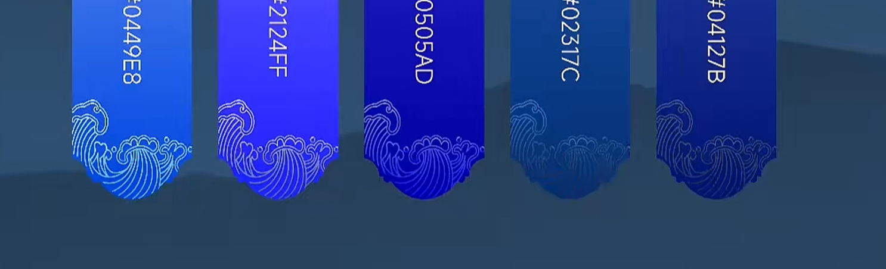
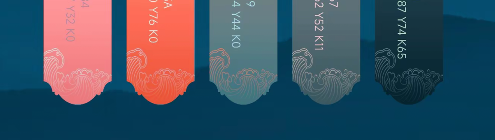

# 视觉主题规范

> 本页定义 Radish 首版 `dev` 的视觉改造与主题创建规范，用于指导 **国风视觉基线、主题切换与后续 UI 改造**。
>
> 本规范面向：
>
> - `radish.client` 的整体 UI 改造
> - 国风主题的风格边界与 Token 约束
> - 后续组件、页面与视觉验收的统一判断标准
>
> 关联文档：
>
> - [视觉颜色参考](/frontend/visual-color-reference)
> - [前端设计](/frontend/design)
> - [首版 dev 边界](/planning/dev-first-scope)
>
> 当前阶段约束：
>
> - 首版先覆盖 `radish.client`
> - 首版先做核心页面
> - 首版先做稳定可用的主题机制，不做“大而全”视觉治理

## 1. 设计目标

本轮 UI 改造不是简单“换皮”，而是建立一套可长期演进的视觉标准。

当前目标是：

1. 为 Radish 建立 **淡雅新中式** 的稳定视觉方向；
2. 让社区、聊天、商城、文档等模块在统一风格下仍能保留各自层次；
3. 通过主题 Token 和组件规则，为后续主题切换与国际化提供稳定底座；
4. 避免把“国风”做成刻意、厚重、戏剧化的装饰样式。

## 2. 风格关键词

### 2.1 关键词

- 温润
- 克制
- 留白
- 纸感
- 印色感
- 轻纹样
- 淡雅
- 层次分明

### 2.2 避免的方向

- 过度宫廷化
- 过度红金化
- 过度国潮海报化
- 过度复古旧物感
- 过多视觉装饰导致阅读负担

## 3. 总体视觉原则

### 3.1 先结构，后装饰

优先保证页面结构、层级、可读性和交互状态清晰，再决定如何加入纹样、边饰和主题氛围。

### 3.2 先气质，后符号

目标是“看起来有中式气质”，而不是“到处贴中国风符号”。

### 3.3 装饰退后一级

纹样、边饰、山纹、水纹、云纹只负责增添气质，不能压过内容本身。

### 3.4 阅读优先

论坛、聊天、文档、商城都属于长时间阅读和交互界面，因此正文可读性、表单清晰度、状态对比度必须优先于装饰性。

## 4. 配色原则

当前配色母板以 [视觉颜色参考](/frontend/visual-color-reference) 为准。

### 4.1 角色分层

主题颜色必须按角色使用，不允许“看到喜欢的颜色就直接上页面”。

颜色角色分为：

1. 背景色
2. 面板色
3. 文本色
4. 品牌色
5. 模块辅助色
6. 状态色
7. 纹样线稿色

### 4.2 用色规则

- 大面积背景优先使用纸色、米色、浅灰暖色。
- 强调色优先使用低面积高识别的方式。
- 辅助色只用于区分模块，不可抢主品牌焦点。
- 同一屏同时出现的强色不超过 2 组。

### 4.3 色彩感受目标

- 主观感受应更接近“纸、墨、印、染、玉、木”，而不是“荧光、塑料、金属”。

## 5. 纹样系统

### 5.1 目标气质

参考图体现的不是重纹饰，而是这种处理方式：

- 线稿细
- 密度低
- 透明度低
- 只在边缘出现
- 更像压纹、描边、暗纹

这一原则作为当前纹样系统的基准。

### 5.2 推荐纹样类型

- 云纹
- 水纹
- 山纹
- 折枝或章纹式简化边饰

### 5.3 允许使用的位置

- 页面顶部 / 底部收边
- 卡片底角
- 面板边框内侧
- 弹窗标题区弱装饰
- Hero、空状态、欢迎页的次级背景层

### 5.4 禁止使用的位置

- 长篇正文阅读区主背景
- 输入框内部
- 表格密集内容底层
- 列表项大面积重复平铺
- 弹窗正文主内容区中央

### 5.5 纹样表现规则

- 默认优先使用单色线稿，不使用复杂彩绘纹样。
- 默认透明度必须低于主要边框和正文文本。
- 纹样线宽应细于标准分割线，避免显得厚重。
- 在移动端优先减少纹样密度，不追求完整展示。

## 6. 组件风格规范

### 6.1 桌面 Shell

- 背景以低对比度层次为主，不做强烈大图背景。
- Dock、状态栏和窗口层要有统一的“纸质半透 + 温润描边”感觉。
- 国风元素优先通过边缘处理和微弱底纹体现。

### 6.2 窗口

- 窗口应保持轻盈，不做厚重木框感。
- 边框和阴影要柔和，避免现代霓虹玻璃质感过强。
- 标题栏允许加入极轻的纹样收边或细线装饰。

### 6.3 卡片

- 以浅色底、柔边框、轻阴影为主。
- 可在底角加入极弱纹样。
- 信息层级靠留白和排版，不靠大面积重色块。

### 6.4 按钮

- 主按钮使用品牌主色，但保持克制。
- 次按钮优先采用描边或柔底样式。
- 不使用强塑料感高光或夸张渐变。

### 6.5 输入框与表单

- 输入区必须保持清晰、平静、易读。
- 表单不要使用明显纹样底图。
- 聚焦态可用主品牌色或墨蓝系做细描边强调。

### 6.6 标签与状态

- 标签采用低饱和浅底 + 深字方案。
- 状态色保留含义，但避免互联网默认荧光色感。

### 6.7 弹窗与浮层

- 浮层应延续卡片和窗口风格，不单独做成另一套强装饰体系。
- 可在标题区或底角使用弱纹样，不影响阅读。

## 7. 页面改造优先级

### 7.1 第一批

首版必须优先覆盖：

- WebOS Shell
- 论坛
- 聊天室
- 商城
- 文档
- 通知中心
- 个人中心

### 7.2 第二批

- 空状态与欢迎页
- 辅助弹窗
- 次级管理型页面
- 边角状态与不高频页面

## 8. 主题机制规范

### 8.0 当前实现状态（2026-03-19）

当前首轮实现已完成以下落地：

- `radish.client` 已建立独立主题目录与根级主题 Token；
- 已提供 `default / guofeng` 两套主题定义与本地持久化切换；
- 已完成桌面壳层首批接入：
  - Shell
  - Dock
  - Desktop 图标容器
  - DesktopWindow
- 已完成一轮桌面壳层回归修复，当前已确认：
  - Dock 顶部居中定位恢复稳定
  - 桌面图标恢复两列布局

当前仍未完成的部分：

- 论坛、聊天室、商城、文档、通知中心、个人中心等高频业务页的主题接入；
- 更细的纹样装饰策略与页面级验收；
- `radish.client` i18n 与主题切换的联合适配验证。

### 8.1 首版主题范围

首版只要求：

- `radish.client` 支持至少两套主题：
  - 默认主题
  - 国风主题

### 8.2 Token 分层

建议至少分为：

- `color`
- `surface`
- `text`
- `border`
- `shadow`
- `pattern`
- `radius`
- `spacing`

### 8.3 命名建议

推荐格式：

```css
--theme-bg-app
--theme-bg-surface
--theme-text-primary
--theme-border-soft
--theme-brand-primary
--theme-accent-jade
--theme-pattern-line
```

规则：

- 使用“角色命名”，不用“具体颜色命名”直接绑死实现。
- 不允许在组件里散落硬编码主题色。
- 组件只消费 Token，不直接定义整套主题。

### 8.4 当前推荐实现路径

首轮实现建议采用如下结构：

```text
Frontend/radish.client/src/theme/
  theme.ts
  theme-tokens.css
  ThemeProvider.tsx
  useTheme.ts

Frontend/radish.client/src/stores/
  themeStore.ts
```

约束如下：

- 主题定义集中在 `theme.ts` 与 `theme-tokens.css`；
- 组件只消费 CSS Token，不在模块 CSS 中重复声明主题色；
- 主题切换状态统一收敛到 `themeStore`；
- 首屏初始化时即写入根节点主题属性，避免首屏闪动或错误主题短暂出现；
- 后续页面接入时优先替换硬编码颜色，再考虑增加弱纹样或更细节的视觉打磨。

## 9. i18n 与视觉协同规则

### 9.1 文字长度冗余

- 标题、按钮、标签、筛选项必须给中英文长度差留余量。
- 不能因为中文短就把组件宽度卡得过死。

### 9.2 字体策略

- 中文字体要有温润、清晰的阅读感；
- 英文和数字字体要和中文并排协调，不要出现明显时代断层；
- 标题字体和正文字体可以分工，但首版不要引入过多字体家族。

### 9.3 装饰与语言切换

- 纹样是风格背景，不应依赖某一种语言环境才成立；
- 切语言后不能靠图片文字或装饰字形承担关键信息。

## 10. 验收标准

首版视觉主题相关工作至少满足：

1. 已有一份稳定的视觉规范文档；
2. `radish.client` 已建立主题 Token 层；
3. 国风主题已覆盖第一批核心页面；
4. 主题切换后主要页面不崩、不乱、不出现明显样式断层；
5. 纹样装饰不影响阅读和交互；
6. 主题实现不会阻碍后续 i18n 接入；
7. 后续 UI 修改可继续引用本规范，而不是重新各做一套。

## 11. 参考素材

### 11.1 颜色参考

- [视觉颜色参考](/frontend/visual-color-reference)
- `Docs/frontend/theme-assets/visual-color-reference-demo.html`

### 11.2 纹样参考图





### 11.3 参考图结论

两张参考图传达的核心方向应总结为：

- 不重，不满
- 不抢内容
- 有边饰感，不有贴花感
- 有东方气质，但保持现代界面的简洁与秩序

## 12. 维护规则

- 后续新增主题、换色或大规模 UI 改造前，先更新本规范。
- 若某次实现与本规范冲突，应优先修改实现，而不是绕过规范。
- 如果后续验证发现规范本身不合理，再回到本页迭代，而不是在组件里单点妥协。
