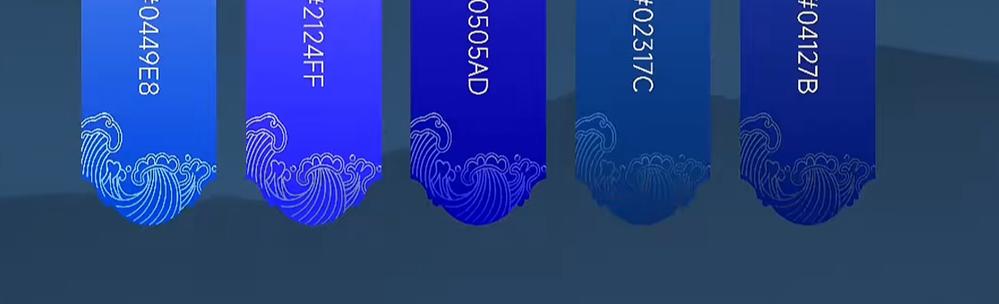
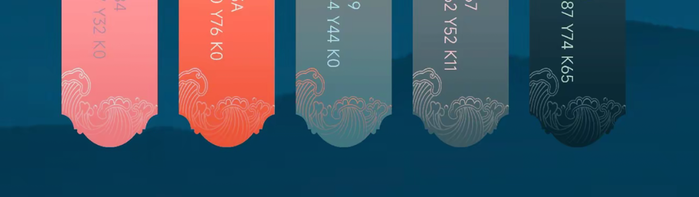

# 视觉主题规范

> 本页保留 Radish 产品视觉、四主题运行时和页面气质契约。`2026-08-03` 起，家族通用颜色、字体、间距、状态语义和组件基线遵循 RadishX `family-ui v26.7.3`；上游默认配色不替代 Radish 四主题契约，项目差异见 [Radish UI 差异附录](/frontend/ui-addendum)，实施批次见 [F4-R 家族 UI 统一接入与产品视觉重构](/features/family-ui-convergence-design)。
>
> 本规范面向：
>
> - `radish.client` 的整体 UI 改造
> - 国风主题的风格边界与 Token 约束
> - 后续组件、页面与视觉验收的统一判断标准
>
> 关联文档：
>
> - [视觉颜色参考](/frontend/visual-color-reference)
> - [UI 设计灵感参考](/frontend/ui-design-inspiration)
> - [前端设计](/frontend/design)
> - [首版 dev 边界](/planning/dev-first-scope)
>
> 当前阶段约束：Web 优先、Flutter 次级；WebOS `/desktop` 只兼容，Tauri 暂时弃用。通用 Token 先等价接入，再按[Pencil 代表页协作流程](/frontend/pencil-representative-page-workflow)推进视觉重构。六个 R1、四个 R2 与六组 Web R3 的实现 / 运行态均已关闭；[Web 主题退出门禁审计](/records/f4-r-web-theme-exit-readiness-audit-2026-08-15)已固定 T01 主题语义、T02 reduced-motion 与 T03 四主题运行态三批，Web 基线稳定后再进入 Flutter 语义映射。

## 1. 设计目标

本轮 UI 改造不是简单“换皮”，而是建立一套可长期演进的视觉标准。

当前目标是：

1. 为 Radish 建立 **淡雅新中式** 的稳定视觉方向；
2. 让社区、聊天、商城、文档等模块在统一风格下仍能保留各自层次；
3. 通过主题 Token 和组件规则，为后续主题切换与国际化提供稳定底座；
4. 避免把“国风”做成刻意、厚重、戏剧化的装饰样式。

## 2. 风格关键词

### 2.1 关键词

- 温润
- 克制
- 留白
- 纸感
- 印色感
- 轻纹样
- 淡雅
- 层次分明

### 2.2 避免的方向

- 过度宫廷化
- 过度红金化
- 过度国潮海报化
- 过度复古旧物感
- 过多视觉装饰导致阅读负担

## 3. 总体视觉原则

### 3.1 先结构，后装饰

优先保证页面结构、层级、可读性和交互状态清晰，再决定如何加入纹样、边饰和主题氛围。

### 3.2 先气质，后符号

目标是“看起来有中式气质”，而不是“到处贴中国风符号”。

### 3.3 装饰退后一级

纹样、边饰、山纹、水纹、云纹只负责增添气质，不能压过内容本身。

### 3.4 阅读优先

论坛、聊天、文档、商城都属于长时间阅读和交互界面，因此正文可读性、表单清晰度、状态对比度必须优先于装饰性。

### 3.5 淡雅古风 UI 参考

纯 Web 公开入口可以吸收 MiMo Code 这类“现代 UI + 淡雅东方视觉”的处理方式，但只吸收视觉语言，不改变 Radish 的信息架构。`/` 与 `/discover` 的默认体验仍以公开内容流为主，不做营销式品牌首页、独立产品承诺首屏或能力介绍页。

- 公开内容流可使用浅纸色背景、低对比水墨 / 山纹 / 云纹和萝卜 IP 线稿作为边缘承托，但不能牺牲首屏内容密度。
- 英文或品牌名可使用现代无衬线，中文分区标题可使用衬线字体，正文、列表、筛选和按钮仍保持无衬线以保证阅读效率。
- 帖子、公开文档、圈子动态、用户摘要或 Console 治理截图可以嵌入轻水墨、书页、山纹和云纹背景中，但这些纹理应服务真实内容，而不是生成额外宣传段落。
- 按钮、筛选、浮动入口和命令式控件可采用细描边胶囊、浅底按钮和小面积深色主按钮，避免厚重渐变或大面积强色。
- 移动端保留相同视觉气质，但进一步减少背景细节，优先保证信息流连续浏览。

这一方向适用于公开内容流、列表、详情、欢迎页、空状态和轻量引导页中的视觉处理；不用于新增宽幅能力 band 或降低内容密度。论坛列表、详情阅读、Console、表格和编辑器仍以信息效率为主。

## 4. 配色原则

当前配色母板以 [视觉颜色参考](/frontend/visual-color-reference) 为准。

### 4.1 角色分层

主题颜色必须按角色使用，不允许“看到喜欢的颜色就直接上页面”。

颜色角色分为：

1. 背景色
2. 面板色
3. 文本色
4. 品牌色
5. 操作色
6. 模块辅助色
7. 状态色
8. 纹样线稿色

### 4.2 用色规则

- 大面积背景优先使用纸色、米色、浅灰暖色。
- 强调色优先使用低面积高识别的方式。
- 辅助色只用于区分模块，不可抢主品牌焦点。
- 同一屏同时出现的强色不超过 2 组。
- `guofeng` 品牌使用灰玉 `#5d6c57`，悬停使用 `#6e736d`；常规操作、链接和 focus 继续使用墨蓝 `#435c74`，不因更换品牌色合并两种语义。

### 4.3 色彩感受目标

- 主观感受应更接近“纸、墨、印、染、玉、木”，而不是“荧光、塑料、金属”。

## 5. 纹样系统

### 5.1 目标气质

参考图体现的不是重纹饰，而是这种处理方式：

- 线稿细
- 密度低
- 透明度低
- 只在边缘出现
- 更像压纹、描边、暗纹

这一原则作为当前纹样系统的基准。

### 5.2 推荐纹样类型

- 云纹
- 水纹
- 山纹
- 折枝或章纹式简化边饰

### 5.3 允许使用的位置

- 页面顶部 / 底部收边
- 卡片底角
- 面板边框内侧
- 弹窗标题区弱装饰
- Hero、空状态、欢迎页的次级背景层

### 5.4 禁止使用的位置

- 长篇正文阅读区主背景
- 输入框内部
- 表格密集内容底层
- 列表项大面积重复平铺
- 弹窗正文主内容区中央

### 5.5 纹样表现规则

- 默认优先使用单色线稿，不使用复杂彩绘纹样。
- 默认透明度必须低于主要边框和正文文本。
- 纹样线宽应细于标准分割线，避免显得厚重。
- 在移动端优先减少纹样密度，不追求完整展示。

## 6. 组件风格规范

### 6.1 桌面 Shell

- 背景以低对比度层次为主，摒弃强烈的大图背景，代之以结合 `mask-image` 注入的极低透明度山水 / 云浪 SVG 面板，配以 30~40s 周期的呼吸动画（云卷云舒）。
- 桌面边界不再是单调的一条白线，而是通过叠加多层 `inset box-shadow` 实现立体纵深的“裱画木框”效果。
- 桌面级右键菜单（ContextMenu）支持在左侧注入如信笺折痕的强调边，悬浮选中时提供红色“朱文印章”样式的微标点缀。
- Dock、状态栏和图标网格层保持高度的“纸质半透 + 温润描边”感觉，其中 Dock 展开动效使用 `500ms` 慢速贝塞尔曲线，完美模拟“画轴平铺”的收放体验。图标排列加强网格密度（宽度约 80px），利用胭脂红内阴影微雕实现“玉牌 / 印章”隐喻。

### 6.2 窗口

- 窗口维持轻盈，以四角微倒角（4px 等极小圆角）代替夸张的圆润感，强化东方榫卯方正结构。控制按钮（最小/大化、关闭）由 Mac 默认圆点风格变更为弱对比微倒角矩形。
- 边框和阴影保持柔和，窗口挂载（出现）时引入类似“水滴/泼墨”散开的 `clip-path` 和 `scale` 中心扩散动画（0.5s 缓慢过渡）。
- 标题栏或工具栏允许加入极轻的水纹/云卷等 `SVG mask-image` 边饰收尾（如 `padding-bottom` 后叠加的底部线条）。
- Public / Workbench 的页面、导航、列表与操作默认使用现代无衬线字体，保证紧凑扫描和多语言稳定；衬线字体只用于论坛正文、文档阅读、长内容标题等明确的编辑式阅读场景，不再作为所有应用级主标题的强制规则。
- 页面、区块、面板和弹窗标题必须直接表达真实页面、对象或任务。
- 禁止在标题上方设置装饰性眉题；英文大写栏目名、中文分类词、路由 / 阶段 / 编号标签和主标题的同义复述，无论语言、字号或字距如何，均不得作为眉题出现。
- 禁止在标题下方悬挂仅用于解释标题、同义复述或营造氛围的描述性副标题。允许一行不可被标题等价替代的真实任务或内容范围说明，但它必须直接帮助用户判断“这里有什么 / 下一步做什么”；状态、数量、时间、来源、权限和操作提示继续进入元数据、控件提示、内联反馈或状态区域。

### 6.3 卡片

- 以浅色底、柔边框、轻阴影为主。
- 可在底角加入极弱纹样。
- 信息层级靠留白和排版，不靠大面积重色块。

### 6.4 按钮

- Brand 展示面可使用品牌色 CTA；Workbench、表单、表格和常规任务主按钮使用操作色。
- 品牌实底前景使用 `text-on-brand`，操作实底前景使用 `text-on-action` 语义；代码迁移期间后者映射现有 `--rd-text-on-accent`，不能用同一个“反色文字”变量掩盖对比度差异。
- 次按钮优先采用描边或柔底样式。
- 不使用强塑料感高光或夸张渐变。

### 6.5 输入框与表单

- 输入区必须保持清晰、平静、易读。
- 表单不要使用明显纹样底图。
- 聚焦态使用 `focus-ring` 或操作色做细描边强调，不借品牌色表达通用交互状态。
- 高密度创作场景优先采用“工具带 + 正文主区 + 薄状态栏”的结构，不把说明文案、提示条或大按钮堆在正文上方。
- 富文本输入体验可以存在，但存储格式应尽量统一；当产品同时支持 Markdown 与富文本时，视觉上应强调“同一内容模型，不是两套并列产品”。

### 6.6 标签与状态

- 标签采用低饱和浅底 + 深字方案。
- 状态色保留含义，但避免互联网默认荧光色感。

### 6.7 弹窗与浮层

- 浮层应延续卡片和窗口风格，不单独做成另一套强装饰体系。
- 可在标题区或底角使用弱纹样，不影响阅读。
- 高使用频率的创作 / 评论浮层不宜继续沿用通用“白板 + 大留白”壳层，应压缩 `handle / header / body` 留白，让编辑器或正文主体优先占据第一屏。
- 当浮层内部已经存在完整编辑器卡片时，外层壳体应弱化边框与额外包裹感，避免出现“双层大白框”。

### 6.8 Web-first 公开页面

- 默认根路径承接 `/discover` 公开内容流，不做传统营销站，也不恢复 WebOS 工作台首屏；首屏应优先呈现可浏览内容、必要筛选和登录后轻互动入口。
- 页面主体优先保持信息流、瀑布流、列表、筛选和侧栏的内容密度，不把默认公开入口改成宽幅能力 band 或宣传段落。
- 淡雅古风视觉只作为浅纸色底、局部纹理、边缘收边、空态、标题气质和控件层级出现，不能压过真实内容。
- 桌面端可使用内容网格、瀑布流或主内容 + 侧栏布局；移动端统一保持单列连续浏览，并降低背景纹理密度。
- `/discover`、`/forum` 详情、`/u/usr_...`、`/circle` 等真实页面截图应优先作为视觉资产来源，而不是使用抽象占位图。
- CTA 必须出现在具体上下文中并指向真实动作，不把“进入发现 / 登录 / 文档”做成独立三按钮首屏。

### 6.9 正式 Web Shell 组件

- `radish.client` 的 public / private header、移动底栏和通用状态槽优先复用 `Frontend/radish.client/src/components/web-shell/`，不要在单个页面继续散写分叉样式。
- `WebShellHeader` 负责 PC 横向 header 与移动浮动胶囊底栏；移动底栏最多 5 项，低频入口由 `/workbench` 承接。
- `WebStateSlot` 负责加载、空态、错误、未找到、权限限制、登录恢复和普通信息状态；状态说明必须解释原因和下一步动作，不出现无解释空白页。
- 公开内容宽度使用 `--rx-content-max-width`、`--rx-content-reading-width`、`--rx-content-narrow-width`，移动页面底部留白使用 `--rx-mobile-shell-offset`。
- 这些组件只约束正式 Web public / private 壳层；WebOS `/desktop` 和 Console 仍按各自壳层规范维护，不直接复用 client Web shell。

### 6.10 R1-P01 现代自然紧凑基准

`R1-P01 / 社区发现 / PC 1440` 是首个获确认的 Public 内容流 PC 代表页。新页面可以继承其视觉语法，但不得复制社区页的信息架构、对象组合或主次关系。

- **结构**：建立一个主任务轴和一个从属上下文区，优先使用不等权的两区关系、连续工作面和异构模块尺度；禁止同尺寸卡片墙、后台式常驻侧栏和为了“丰富”而复制 Dashboard。
- **密度**：以真实 `1440px` 浏览器、`100%` 缩放为桌面评审语境；使用 `8 / 12 / 16 / 24px` 为主的间距节奏，常规连续扫描行约 `56～72px`，不得通过放大字号、控件和留白填满页面。
- **表面**：使用低对比页面底、近白浮起表面、发丝边框、`10～16px` 克制圆角和单层极轻阴影；避免整页外部展示框、双层大白框和卡片套卡片。
- **排版**：产品壳层、列表、控件与数据默认使用现代无衬线；标题直接命名真实页面、对象或任务。只允许一行提供真实任务 / 内容范围的目的说明，不保留可被标题替代的解释或氛围文案。
- **颜色**：只消费语义 token。`guofeng` 以灰玉承担品牌识别、墨蓝承担主操作，国风暖白承担页面与表面；状态色和辅助色只做小面积识别，不建立高饱和 Dashboard 色板。
- **混合信息**：不同实体使用稳定类型标记，并在同一扫描轴组织“标题 / 元数据 / 摘要 / 类型专属反馈”；既保持对象可辨识，也不为每种对象建立一套平行卡片。
- **数据反馈**：趋势、热力点阵和进度只在帮助判断内容状态或参与价值时内嵌呈现；禁止用图表填空、重复已有指标或把内容页改成分析看板。
- **动作**：每个区域最多一个主动作，次动作降级为图标、文本或柔底；内容区与洞察区必须有明确权重差，不让所有按钮和卡片同时争抢焦点。
- **移动端**：按移动任务顺序独立重排，优先真实内容、搜索和当前动作；不得缩放 PC，也不得把桌面从属区完整堆到正文末尾。
- **事实边界**：概念对象必须在专题中标明 API / 读模型缺口。视觉审核通过只代表目标契约成立，不代表接口、代码或运行时已完成。

新页面开始设计前记录一份轻量继承卡：

```text
继承基准：R1-P01 / 社区发现 / PC 1440（或更接近的已确认代表页）
保留语法：表面 / 密度 / 排版 / 用色 / 动作 / 数据表达
页面差异：主任务 / 布局 / 实体 / 状态 / mobile 转换
事实缺口：未落地接口、读模型或权限边界
```

继承的是视觉语法，不是页面模板；如果主任务、响应式模型或关键状态无法由既有代表页解释，应按代表页流程升级为 R1 / R2。

### 6.11 R1-P02 连续阅读与讨论基准

`R1-P02` 的长期结构以 [Public 详情与互动审计](/records/f4-r-r1-p02-public-detail-interaction-audit-2026-08-05)为准：

- 正文、帖子操作、条件回答区、轻回应和评论使用一个连续阅读—讨论主轴，不按后端能力逐块堆成同权卡片。
- 帖子动作只保留一个统一操作带；次要动作、作者动作和溢出动作按语义分组，不在侧栏和功能区重复。
- 桌面从属区只提供章节定位和真实数量等独占价值，不展示内部语义说明或全高 Dashboard rail。
- mobile 按来源、正文、当前动作和讨论顺序独立重排；桌面线程索引内联化，不整体追加到页面尾部。
- 设计只表达当前 Public 已开放能力，不因共享组件存在回复、点赞、reaction 或删除回调而创建未获批准的动作。

## 7. 当前视觉重构顺位

### 7.1 C-1B 代表设计复核

F4-R 已完成 A / B、C-0 与 C-1A。C-1B 已在 `radish-web-family-ui-v1.pen` 完成 `R1-F01`，并关闭 `R1-P01 / 社区发现` PC / mobile、统一公开读模型、实现与运行态复核；后续按以下顺位推进：

1. `R1-P02` 代码事实、功能权限、状态和 PC / mobile 当前结构审计已经完成。
2. 用户确认连续阅读面、统一帖子操作带、条件回答区与线程索引方向后，在活动设计源比较 `2～3` 个低保真 PC 构图。
3. 方向获选后只保留唯一 PC / mobile 正式画板和必要关键状态，不为身份、主题、语言或帖子类型复制整页。
4. 代表设计确认后再拆分超限详情容器并成组实现；专题准备验收时执行真实 PC / mobile 截图复核。
5. 后续设计轨按 `R1-A01 → R1-W01 → R1-C01 → R1-C02` 推进；R3 页面按继承卡直接实现，出现新布局、关键交互或 mobile 模型时再升级。

代表页编号、路由族与升级规则以 [F4-R 代表页代码事实审计](/frontend/f4-r-representative-page-audit)和 [Pencil 代表页协作流程](/frontend/pencil-representative-page-workflow)为准。

### 7.2 实现与多端顺位

- 代表结构和共享契约确认后，先完成正式 Web 的共享基座，再按已复核页面族成组实现和真实截图验收。
- Flutter 等 Web 基线稳定后，只承接有明确移动原生价值的路径，不机械复制 Web。
- WebOS `/desktop` 只保持阻断级兼容，不作为新视觉组件或页面模板来源。
- Tauri 暂时弃用，不进入视觉设计、实现、构建或验收范围。

## 8. 主题机制规范

### 8.0 当前实现状态（2026-07-14）

正式主题运行时已完成并进入维护：

- 内置主题：`default / guofeng`，匿名和登录用户都可直接选择；默认内置偏好为 `guofeng`。
- 权益主题：`theme-dark-night / theme-sakura`，必须由登录用户拥有并在服务端激活对应 Theme 权益。
- `themeStore` 同时保存内置偏好、当前有效主题、已拥有主题权益和服务端当前选择；切回内置主题时先停用当前 Theme 权益。
- `ThemeProvider` 统一根节点 `data-theme`、CSS `color-scheme`、语义 token、共享 `@radish/ui` 和 Ant Design theme config。
- `radish_client_builtin_theme` 保存内置回退偏好，`radish_client_theme` 保存当前有效主题；跨标签同步只影响同一浏览器设备。
- 登录、登出、权益到期、撤销或失效时重新读取服务端选择；无有效 Theme 权益时回退内置偏好，不保留无权主题外观。
- Header 在 PC / mobile 提供正式主题入口；`/desktop` 复用同一运行时，不维护第二套主题状态。
- 主题商品资源值只接受共享白名单 `theme-dark-night / theme-sakura`，能力开放不强制上架历史商品。

页面只消费语义 token，不根据主题 ID 在业务组件内复制整套颜色。新增主题必须先扩展注册表、共享资源白名单、主题 token、可读性验证和失效回退，再允许商品配置。

### 8.1 首版主题范围

正式范围固定为四套注册主题：

| ID | 访问方式 | 色彩模式 | 产品语义 |
| --- | --- | --- | --- |
| `default` | 内置 | light | 中性青灰基础主题 |
| `guofeng` | 内置 | light | 默认淡雅新中式主题 |
| `theme-dark-night` | Theme 权益 | dark | 暗夜低亮度主题 |
| `theme-sakura` | Theme 权益 | light | 樱花柔粉主题 |

### 8.2 Token 分层

当前固定分层：

- family-ui L0 色板与 L1 `--rd-*` 语义 token；
- Radish 四主题取值与 `--theme-* / --console-*` 过渡 L2；
- 正式 Web `--rx-*`、WebOS 和页面布局等壳层 / 领域 token。

### 8.3 命名

家族通用组件优先使用：

```css
--rd-bg-app
--rd-bg-surface
--rd-text-primary
--rd-border-soft
--rd-brand-primary
--rd-action-primary
--rd-state-danger
```

规则：

- 使用“角色命名”，不用“具体颜色命名”直接绑死实现。
- 不允许在组件里散落硬编码主题色。
- 迁移期组件可继续消费已映射的 `--theme-* / --console-* / --rx-*`，不直接定义整套主题。

### 8.4 当前推荐实现路径

当前实现结构：

```text
Frontend/radish.client/src/theme/
  theme.ts
  theme-tokens.css
  ThemeProvider.tsx
  ThemeSwitcher.tsx
  themeEntitlements.ts
  themeEntitlementSnapshot.ts
  useTheme.ts

Frontend/radish.client/src/stores/
  themeStore.ts
```

约束如下：

- 主题定义集中在 `theme.ts` 与 `theme-tokens.css`；
- 组件只消费 CSS Token，不在模块 CSS 中重复声明主题色；
- 主题切换状态统一收敛到 `themeStore`；
- 首屏初始化时即写入根节点主题属性，避免首屏闪动或错误主题短暂出现；
- 后续页面接入时优先替换硬编码颜色，再考虑增加弱纹样或更细节的视觉打磨。

## 9. i18n 与视觉协同规则

### 9.1 文字长度冗余

- 标题、按钮、标签、筛选项必须给中英文长度差留余量。
- 不能因为中文短就把组件宽度卡得过死。

### 9.2 字体策略

- 中文字体要有温润、清晰的阅读感；
- 英文和数字字体要和中文并排协调，不要出现明显时代断层；
- 标题字体和正文字体可以分工，但首版不要引入过多字体家族。

### 9.3 装饰与语言切换

- 纹样是风格背景，不应依赖某一种语言环境才成立；
- 切语言后不能靠图片文字或装饰字形承担关键信息。

## 10. 验收标准

首版视觉主题相关工作至少满足：

1. 已有一份稳定的视觉规范文档；
2. `radish.client` 已建立主题 Token 层；
3. 四套注册主题覆盖正式 Web 页面族，权益主题受服务端当前选择约束；
4. 主题切换、登录同步、停用、到期、撤销和登出回退后主要页面不崩、不乱、不出现明显样式断层；
5. 纹样装饰不影响阅读和交互；
6. ThemeSwitcher、Ant Design locale 与 i18n 状态相互独立，语言切换不改主题，主题切换不改语言；
7. 后续 UI 修改可继续引用本规范，而不是重新各做一套。

## 11. 参考素材

### 11.1 颜色参考

- [视觉颜色参考](/frontend/visual-color-reference)
- `Docs/frontend/theme-assets/visual-color-reference-demo.html`

### 11.2 纹样参考图





### 11.3 参考图结论

两张参考图传达的核心方向应总结为：

- 不重，不满
- 不抢内容
- 有边饰感，不有贴花感
- 有东方气质，但保持现代界面的简洁与秩序

### 11.4 现代产品 UI 参考

[UI 设计灵感参考](/frontend/ui-design-inspiration) 收录 AFFINE、CodexApp、Cloudflare、GitHub、Discourse 与 1Panel 的界面截图，并将其提炼为布局、信息密度、设置页、管理后台、社区列表和色彩节奏参考。

这些素材只用于学习现代产品的信息组织与视觉克制方法，不改变 Radish 的淡雅新中式主题方向。后续页面级或客户端级 UI 优化先审计当前代码并裁决 R1 / R2 / R3：代表结构和关键状态通过 Pencil 确认，相似派生页面继承既有契约直接实现并用真实截图复核。

### 11.5 family-ui 参考素材门禁

- 页面级视觉工作必须先完整阅读 RadishX `docs/design/family-ui/references.md`，并逐张查看其中索引的参考图；只读取 `README.md` 或复制 token 不算完成参考审计。
- 每个代表页面族必须在 [F4-R 专题](/features/family-ui-convergence-design)中说明吸收什么、排除什么；参考图只用于内部原则提炼，不作为产品素材。
- mobile 必须从任务优先级、导航、安全区和触控密度重新设计，不得把桌面参考图等比缩放。
- Radish 的产品边界、四主题权益、功能、文案、按钮、权限和状态机仍以本仓库文档与当前代码为准，具体差异见 [Radish UI 差异附录](/frontend/ui-addendum)。

## 12. 维护规则

- 家族通用规则优先更新 RadishX family-ui；Radish 产品差异、主题权益或大规模 UI 改造前，更新本页、差异附录与 F4-R 专题。
- Pencil 只维护共享视觉契约和主要页面，不承担功能、文案、权限或所有路由的完整镜像。
- 若某次实现与本规范冲突，应优先修改实现，而不是绕过规范。
- 如果后续验证发现规范本身不合理，再回到本页迭代，而不是在组件里单点妥协。
