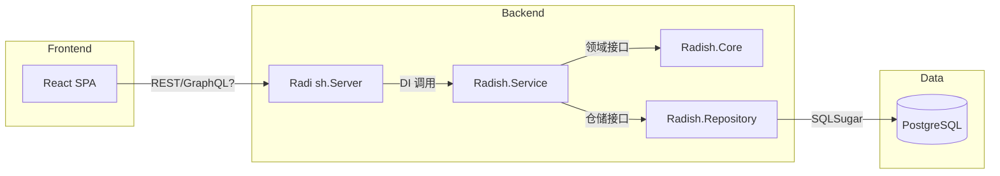

# 开发整体架构

> 本文描述 Radish 现阶段的目标模型、技术选型与分层架构，面向参与后端、前端与运维的贡献者。所有内容均基于「.NET 10 + SQLSugar + PostgreSQL + React(Vite)」的新栈，ABP/Angular/MongoDB 方案已归档。

## 功能期望与范围

- **核心模块**
  - 身份与会话：自建帐号体系、邮箱/用户名登录、JWT + 刷新令牌、角色与权限控制、第三方登录预留。
  - 门户与文档：React 单页应用 + Swagger/Scalar 嵌入，支持文档直达、健康检查、运维面板。
  - 内容域：分类 / 标签 / 帖子 / 评论 / 点赞 / 收藏 / 浏览计数，列表分页与过滤，富文本编辑。
  - 搜索：按标题、标签、分类、作者检索；支持时间/热度排序与模糊匹配（PostgreSQL `tsvector` 预留）。
  - 通知与订阅（可选）：帖子互动提醒、积分变动提醒，支持站内信或邮件。
  - 积分系统：积分账户、积分流水、规则引擎（发帖、互动、被采纳等）。
  - 商城系统：商品、库存、购买/退款、效果激活（头像框、昵称色、签名等）。
  - 管理后台（同 React 工程内实现管理视图）：分类、内容、用户、积分与商城配置。

- **非功能性要求**
  - 安全：所有前后端流量强制 HTTPS，登录等敏感参数需在前端使用 RSA 公钥加密后发送，后端持私钥解密；结合 JWT + Refresh、基于角色的授权、CSP/CORS、参数验证与敏感信息集中管控。
  - 性能：关键查询 P95 ≤ 200ms；SQLSugar Profile + PostgreSQL EXPLAIN 校验索引；读多写少场景可使用内存缓存。
  - 可用性：健康检查 `/health`, `/ready`; SQLSugar 迁移幂等；容器探针。
  - 可观测性：Serilog 结构化日志、请求跟踪 ID、PostgreSQL 慢查询日志、前端监控埋点。
  - 国际化：后端资源文件（zh-Hans 基线），前端 i18n（React i18next）。
  - 质量：后端 xUnit + Shouldly + NSubstitute，前端 Vitest + RTL，关键链路具备 E2E 冒烟。
  - 配置：`appsettings.{Env}.json` + 环境变量 + `.env`；禁止把密钥写入仓库。

- **里程碑（参阅 DevelopmentPlan）**
  1. M1｜基础设施：解决方案构建、PostgreSQL + SQLSugar 通路、健康检查、React 脚手架跑通。
  2. M2｜领域建模：分类/帖子/评论/用户聚合与仓储、基础 CRUD API。
  3. M3｜应用服务：权限、DTO、业务编排、错误映射与日志规范。
  4. M4｜React MVP：认证、导航、列表/详情/发帖链路、态势监测。
  5. M5｜积分 + 商城：事件驱动积分、商城商品与库存闭环。
  6. M6｜容器与交付：Dockerfile/Compose、自检脚本、CI 验证。

- **范围外 / 边界**
  - 第三方支付、发票、合规认证（GDPR/等保）。
  - 大文件转码与 CDN；多端（小程序/Native App）。
  - 大规模分布式（消息队列、CQRS、多租户），当前阶段聚焦单体 + 水平扩展预留。

## 技术与架构基线

| 领域 | 选型 | 说明 |
| --- | --- | --- |
| 语言/运行时 | C# 13, .NET 10 | `global.json` 锁定 SDK 10.0.0，开启 `Nullable` 与 `ImplicitUsings` |
| Web Host | ASP.NET Core WebApplication | Program.cs 中最小宿主，按需要拆 Controller/Minimal API |
| ORM | [SQLSugar](https://github.com/donet5/SqlSugar) | Code First + Migration，仓储层集中管理上下文，支持读写分离配置 |
| 数据库 | PostgreSQL 16 | 默认端口 5432，连接通过 `ConnectionStrings__Default` 注入 |
| 前端 | React 19 + Vite + TypeScript | Node 24，使用 pnpm/npm 均可；建议 React Query + Zustand/TanStack Router |
| 前端构建 | Vite Rolldown，ESLint 9，Vitest | 统一在 `radish.client` 目录运行 |
| 测试 | xUnit 3 + Shouldly + NSubstitute | `Radish.Server.Tests` 目录；后续可按层拆分 |
| 日志 / 配置 | Serilog + `Microsoft.Extensions.Configuration` | 支持 JSON + 环境变量 + 用户密钥；生产日志输出到 Console + Seq/Elastic 预留 |
| 容器 | Dockerfile（Radish.Server）+ Docker Compose | Compose 负责 PostgreSQL + API + 前端静态站点 |

### 分层视图

```
radish.client (React SPA)
        │ REST/JSON
Radish.Server (ASP.NET Core Host)
        │ 调用应用服务 + DTO
Radish.Service (Application Layer)
        │ 调度
Radish.Core (Domain Layer)
        │ 抽象 + 领域事件
Radish.Repository (Infrastructure, SQLSugar)
        │ SQL
PostgreSQL
```

- `Radish.Server`
  - 负责 DI、配置、日志、全局异常、认证授权、Swagger/Scalar、HealthChecks。
  - 仅保留轻量 Controller/Endpoint，所有核心逻辑委派给 Service 层。
  - API 文档：开发环境把 Scalar UI 映射到 `/api/docs`，并通过 `builder.Services.AddOpenApi("v1|v2")` + `options.AddDocument(...)` 维护多版本；如需定制交互，可在 `Radish.Server/wwwroot/scalar/config.js` 中追加 JS 配置并在 `MapScalarApiReference` 中调用 `WithJavaScriptConfiguration`。
  - 本地调试：`Properties/launchSettings.json` 提供 `http`/`https`（仅启动 API）与 `https+spaproxy`（同时拉起 `radish.client` Vite 服务）两种 Profile，可在 VS/`dotnet run --launch-profile` 间切换作为“联调开关”。
- 配置与服务访问：Program.cs 依次调用 `hostingContext.Configuration.ConfigureApplication()` → `builder.ConfigureApplication()` → `app.ConfigureApplication()` → `app.UseApplicationSetup()`，把 Configuration/HostEnvironment/RootServices 注入到 `Radish.Common.Core.App`；在非 DI 管道下可使用 `App.GetService*`、`App.GetOptions*` 手动解析服务或配置。常规字符串读取仍统一使用 `AppSettings.RadishApp("Section", ...)`，批量强类型配置通过 `ConfigurableOptions + AddAllOptionRegister` 自动绑定 `IConfigurableOptions`。
- `Radish.Service`
  - 应用服务（`*AppService`）封装用例流程、权限校验、事务控制、DTO 转换。
  - 依赖 `Radish.Core` 接口与 `Radish.Repository` 实现，通过 `IUnitOfWork` 控制 SQLSugar 上下文。
  - 对外仅返回 DTO/Vo，禁止把 `Radish.Model` 中的实体直接暴露给 Controller；实体需在此层通过 AutoMapper（一律在 `Radish.Extension/AutoMapperSetup` 注册）转换为视图模型。
- `Radish.Core`
  - 聚合根（Post、Comment、Category、UserProfile、PointLedger、ShopItem 等）、值对象、领域事件。
  - 定义仓储接口与领域服务，例如 `IPostRepository`, `IPointPolicyService`。
- `Radish.Repository`
  - 持久化实现，集中 SQLSugar 配置（连接池、AOP 日志、软删除、审计字段）。
  - 提供迁移/种子帮助类，必要时拆分模块级仓储。
  - 仓储层仅依赖实体类型；返回 Service 层的对象必须是实体或匿名结构，禁止引用 DTO/Vo，保持“实体只存在于仓储层”原则。
- `Radish.Model`
  - DTO、ViewModel、查询对象、枚举。
  - 提供 `PagedRequest`, `PagedResponse<T>`, `ApiError` 等复用结构。
  - 视图模型需以 `Vo` 开头，并结合业务含义做缩写/扩写（如 `VoUsrAudit`, `VoAssetReport`），避免简单加前缀即可猜测真实用途。
- `Radish.Extension`
  - 横切关注：验证、缓存策略、OpenAPI 自定义、JWT 扩展、全局过滤器。
- `Radish.Shared`
  - 常量、错误码、事件名、Options 绑定类型。
- `radish.client`
  - SPA + 内嵌管理视图；共享 DTO 通过 `radish.client/src/types` 维护，与后端模型保持同步。
- `UserController -> IUserService -> IUserRepository` 示例链路
  - 通过内存仓储 + 应用服务演示分层合作，Program.cs 负责注入 `IUserService/IUserRepository`。
  - `.http` 文件与 `Radish.Server.Tests/Controllers/UserControllerTest` 均以该示例为基准，确保开发者可以快速验证分层约定。

### 架构示意



## 核心功能模块（MVP）

| 模块 | 后端职责 | 前端职责 |
| --- | --- | --- |
| 帐号与权限 | 用户、角色、权限、JWT/刷新令牌、密码策略、邮箱验证、登录日志 | 登录/注册/忘记密码，角色控制菜单，Session 续期提示 |
| 分类/标签 | 聚合建模、层级/顺序维护、缓存/快照、只读列表接口 | 分类导航、筛选器、管理表单 |
| 帖子/评论 | CRUD、全文搜索预留、交互指标累加、幂等处理 | 列表、详情、编辑器、Markdown/富文本、骨架屏 |
| 点赞/收藏 | 多表事务（帖子计数 + 用户关系）、幂等 API | 双态按钮、Lazy Update、错误回滚 |
| 积分 | 规则配置、事件订阅（发帖、点赞、被采纳）、流水记录、积分账户锁定 | 积分面板、历史记录、规则展示 |
| 商城 | 商品/库存/价格、购买/退款/激活、权益发放、过期策略 | 商品列表/详情、购买流程、权益展示、我的物品 |
| 管理视图 | 统一权限守卫、数据导出、批量操作、操作日志 | React Admin Layout、表格与筛选、审计信息 |

## 实时交互（SignalR）

- 场景：帖子评论/点赞即时刷新、在线用户状态、积分变化提示、运营公告推送等需要“秒级到达”体验的功能统一通过 SignalR Hub 承载，避免重复造轮子。
- 架构：`Radish.Server` 内新增 `Hubs/*Hub.cs` 定义 strongly-typed Hub；业务层通过注入 `IHubContext<T>` 推送消息，或在 Service 内调度事件。客户端由 `radish.client` 使用 `@microsoft/signalr` SDK 建立连接，统一封装 `useSignalrHub` Hook。
- 协议：默认使用 JSON over WebSocket，自动降级为 Server-Sent Events/Long Polling；如需 Binary 可切换 MessagePack，需在前后端同时开启。
- 安全：连接时附带 JWT/AccessToken，服务端在 `OnConnectedAsync` 中验证身份与租户；Hub Method 名称使用 PascalCase 并在共享 DTO 中定义负载，禁止随意拼字符串。
- 扩展：多实例部署时启用 Redis Backplane（`Microsoft.AspNetCore.SignalR.StackExchangeRedis`）保持消息一致性；对公网推送需配置 TLS 与速率限制，可在 Nginx/Ingress 层结合 IP 限流。

## 数据与持久化策略

- SQLSugar 统一由 `ISqlSugarClient` 提供，使用多租户模式映射不同连接（目前单库）。
- 公共 BaseEntity：`Id`, `CreatedAt`, `CreatedBy`, `UpdatedAt`, `UpdatedBy`, `IsDeleted`, `ConcurrencyStamp`。
- 软删除通过 SQLSugar Filter 全局开启；必要时在仓储层提供 `IncludeDeleted` 选项。
- 迁移策略：
  - 开发：`db.DbMaintenance.CreateDatabase()` + `InitTables()`。
  - 生产：通过 `Radish.Repository.Migrations` 导出 SQL 或在部署阶段运行迁移命令。
- 数据初始化：`SeedRunner` 负责创建默认分类、管理员、积分规则。
- PostgreSQL 特性利用：JSONB 列（存储自定义配置）、`tsvector` 搜索、行级锁（积分/库存扣减）。

## 前端架构与规范

- Vite 配置 HTTPS、代理 API、环境变量区分（`.env.development` / `.env.production`）。
- 目录建议：`features/*`, `entities/*`, `shared/*`, `app/providers`，使用按特性拆包。
- 认证：基于 `fetch`/`axios` 拦截器附带 AccessToken，失效时调用刷新接口（刷新令牌存于 HttpOnly Cookie 或安全存储）。
- 状态管理：React Query 管理异步数据，Zustand/Jotai 管理本地 UI 状态；Form 使用 React Hook Form。
- UI 与可访问性：Tailwind/UnoCSS 原子化 + 自研组件，提供暗色模式与响应式布局。
- 桌面化交互规范：首页呈现类 macOS 桌面，顶部状态栏显示用户名/IP，底部 Dock 承载主功能入口，左侧桌面图标双击弹出带最小化/关闭按钮的窗口，所有弹窗遵循桌面操作逻辑。
- 测试：组件级 Vitest，关键流程 Playwright（可选）。

## DevOps 与运维基线

1. **配置与密钥**：
   - `appsettings.json` 仅放默认值，环境差异通过 `appsettings.{Env}.json` + 环境变量。
   - 本地秘密写入 `dotnet user-secrets` 或 `.env.local`（被 .gitignore 忽略）。
2. **日志与监控**：
   - Serilog 写入 Console + File；在容器中输出 JSON 便于收集。
   - 预留 OpenTelemetry Exporter 与 Prometheus 指标。
3. **部署流水线**：
   - Dockerfile 使用多阶段构建（Restore → Build → Publish）。
   - Compose 负责 PostgreSQL + API + 反向代理（如 Caddy/Nginx），可扩展加上前端静态站点。
   - 生产部署建议挂载 `appsettings.Production.json` 与证书目录，使用 `ConnectionStrings__Default` 环境变量。
4. **质量门禁**：
   - PR 必须附带 `dotnet test` 与 `npm run build` 结果；若变更数据库需提供迁移脚本与回滚建议。
   - 关键模块需要 Code Review + Pair Walkthrough。

---

如需在架构或选型上做进一步调整，请同步更新本文件并在 DevelopmentLog 中记录决策，确保贡献者获取到一致的信息。
