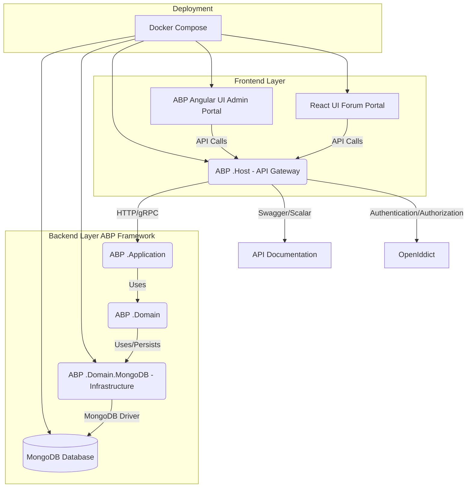

# 开发整体架构

> 开发框架图请点：[Radish](https://affine.imbhj.net/workspace/e54b7d62-20a6-473e-bfc8-0e0f1592b17c/i2ZYOGr95mO5T88PhTKr8) 。

## 功能期望与范围

- 核心功能模块
  - 身份与单点登录（SSO）：OpenIddict（OIDC 授权码 + PKCE）、ABP 身份模块、前后端静默续期与登出回跳。
  - 门户首页与文档：Host 首页聚合跳转（React、Swagger、Scalar），登录态透传与 `sso=auto` 约定（兼容 `sso=true` / `sso=1`）；Swagger/Scalar 授权可调试。
  - 内容域：分类/标签、帖子/评论（基础 CRUD、分页/过滤/排序），点赞/收藏，浏览计数。
  - 搜索与筛选：按标题/标签/分类检索，排序（时间/热度）。
  - 通知（可选）：发帖/回复/点赞等站内通知（可后续迭代）。
  - 积分系统：积分账户、积分流水、规则（发帖/点赞/被采纳等）。
  - 商城系统：商品/库存、购买与激活（基于积分），前端效果应用（头像框/昵称色等）。
  - 管理后台：分类与内容管理、用户与权限、积分/商城管理。

- 非功能性要求
  - 安全：全链路 HTTPS（生产）、CORS 白名单（.env）、CSP 基线、XSS/CSRF/输入校验、最小权限、密钥不入库（仅 .env/.secrets）。
  - 性能：热点接口 P95 ≤ 200ms（本地/容器基线），Mongo 索引、必要的读缓存（只读列表）。
  - 可用性：健康检查（/health-status）、就绪/存活探针（容器化）、幂等迁移（DbMigrator）。
  - 可观测性：结构化日志（Serilog）、关键事件与错误记录；后续可接入指标/追踪。
  - 国际化：服务端本地化资源（zh-Hans 基线），前端复用 ABP 资源；支持切换文化。
  - 测试与质量：后端单测（xUnit + Shouldly + NSubstitute），前端 lint/build 通过；必要端到端冒烟。
  - 配置与运维：统一使用 `.env` 注入（示例 `.env.example`），Docker Compose 一键启动（后续步骤）。
  - 兼容性：主流现代浏览器（Chrome/Edge/Firefox/Safari 最新版），移动端视口友好。

- 里程碑与验收标准（与 DevelopmentPlan.md 对齐）
  - M1｜基线与联调（周1）：Host HTTPS 可访问；React/Angular 能拉取应用配置并通过 CORS；证书与预检命令可自测。
  - M2｜领域与数据（周2）：Category/Post/Comment 模型 + 仓储与索引；CRUD 与分页可用；单测通过。
  - M3｜应用层与 API（周3-4）：DTO/服务/权限齐备；Swagger/Scalar 授权可调试；异常映射一致。
  - M4｜React/Angular MVP（周5-7）：React 列表/详情/发帖流程；Angular 基础管理；登录态与权限生效。
  - M5｜容器化（周8）：Host/DbMigrator/React/Angular Dockerfile 与 Compose；`up --build` 一键跑通。
  - M6｜积分与商城（周9-10）：积分规则闭环；商城购买-库存-应用链路可用。
  - M7｜硬化与交付（周11-12）：性能/安全/观测到位；测试覆盖补全；文档齐备可演示/部署。

- 范围外（当前阶段暂不覆盖）
  - 第三方登录（微信/钉钉/飞书/企业 SSO 等）、支付能力（真实扣款）。
  - SSR/SEO（React 迁移 Next.js）、富媒体文件云存储（可后续接入 S3/OSS）。
  - 消息队列/事件总线与复杂异步编排、CDN 边缘缓存策略。

### 非目标与边界（Non-Goals & Boundaries）

- 认证与支付
  - 非目标：接入外部 OAuth/企业 SSO（微信/钉钉/飞书/企微等）；真实支付/结算流程。
  - 边界：仅提供本地帐号体系 + OpenIddict（授权码 + PKCE）；商城以“积分兑换”为主，不涉及金流与发票。

- 媒体与上传
  - 非目标：大文件与多媒体（视频/音频）转码、图片 CDN 与裁剪、内容审查（OCR/涉政涉黄）。
  - 边界：头像/帖子配图等轻量图片为主；后续如需接入 S3/OSS/本地 MinIO，将单列里程碑。

- 渲染与 SEO
  - 非目标：SSR/SSG 与搜索引擎优化（站外 SEO 策略、sitemap 自动化）。
  - 边界：当前维持 SPA 架构（Vite React），必要时可迁移 Next.js，届时重新评估路由与鉴权。

- 分布式与事件
  - 非目标：Kafka/RabbitMQ 等消息总线、Saga/Outbox、跨服务一致性。
  - 边界：单体服务 + 领域事件（进程内）足以满足 MVP；如需异步扩展，先以内存队列/延时任务验证。

- 性能与扩展
  - 非目标：大规模水平扩展与全局缓存（Redis Cluster/CDN 边缘缓存）。
  - 边界：以 Mongo 索引 + 轻量读缓存为准；热点接口设定 P95≤200ms 的本地/容器基线作为验收。

- 合规与隐私
  - 非目标：严格 GDPR/CCPA/等保三级等合规落地。
  - 边界：遵循最小化采集与脱敏输出原则；提供帐号删除导出基础能力时再进入合规阶段。

- 平台与浏览器
  - 非目标：旧版浏览器/IE 兼容、App 混合容器、小程序端等多端适配。
  - 边界：现代浏览器最新版为支持基线（Chrome/Edge/Firefox/Safari），移动端以响应式适配为主。

- 运维与部署
  - 非目标：K8s 多环境流水线、灰度/蓝绿发布、服务网格、全链路追踪。
  - 边界：以 Docker Compose 一键启动为阶段目标，后续再评估 K8s 化。

- 数据与迁移
  - 非目标：复杂数据迁移编排与版本回滚策略、数据脱敏/同步平台。
  - 边界：DbMigrator 保证幂等，核心索引与种子可重复执行；生产升级前置备份。

- UED 与可用性
  - 非目标：完整设计体系与可访问性 (A11y) 全量达标。
  - 边界：遵循基本可访问性与对比度要求；组件库选型以 ABP Angular/自建轻组件为主。

## 开发大纲

### 项目名称

Radish，萝卜。

### 项目概述

本项目旨在构建一个高性能、可扩展的现代化论坛平台。后端基于ABP框架的分层架构和领域驱动设计（DDD），使用MongoDB作为主要数据存储，并提供完善的RESTful API。后台管理界面采用ABP自带的Angular UI，提供全面的用户、权限和内容管理功能。前端用户界面则使用React开发，专注于提供流畅、响应式的用户体验，实现核心论坛交互。整个项目将通过Docker进行容器化，实现一键启动和部署。未来规划包括积分系统和商城系统，以增强用户互动和平台粘性。

### 1. 技术栈概览

* **后端框架:** [ABP Framework](https://abp.io)（基于 .NET 9，与本仓库一致）
  * **架构模式:** DDD (领域驱动设计) 分层架构
  * **核心模块:** `Volo.Abp.Identity`, `Volo.Abp.PermissionManagement`, `Volo.Abp.AuditLogging`, `Volo.Abp.SettingManagement` 等。
* **API 管理/调试:** [Swagger UI](https://swagger.io/) / [Scalar](https://scalar.com/) (ABP框架自带集成)
* **后台管理UI:** [ABP Angular UI](https://docs.abp.io/en/abp/latest/UI/Angular)
* **前端用户UI:** [React](https://react.dev/) (配合 [Vite](https://vitejs.dev/) 或 [Next.js](https://nextjs.org/) 等构建工具，建议Vite简化配置)
* **数据库:** [MongoDB](https://www.mongodb.com/) (建议 v6.x 或更高版本)
* **容器化:** [Docker](https://www.docker.com/) & [Docker Compose](https://docs.docker.com/compose/)
* **身份认证/授权:** OpenIddict + JWT (JSON Web Tokens)
* **辅助工具:** Git, VS Code/Visual Studio

### 2. 系统架构

#### 2.1 高层架构图

#### 2.2 ABP 后端分层详细说明 (DDD)

* **Radish.HttpApi.Host:**
  * ASP.NET Core Web Application，作为API网关。
  * 配置身份认证 (JWT/OpenIddict)。
    * 集成Swagger/Scalar，提供API文档和调试界面。
    * 配置CORS (跨域资源共享)。
    * 加载并暴露所有应用服务 (Application Services)。
  * **Docker:** 将此项目容器化为API服务。
* **Radish.Application.Contracts:**
  * 定义应用层与表示层 (UI) 之间的数据传输对象 (DTOs)。
  * 定义应用服务接口 (Application Service Interfaces)。
  * **DDD:** DTOs作为输入/输出，是聚合根或实体的扁平化表示。
* **Radish.Application:**
  * 实现应用服务接口。
  * 负责业务逻辑的编排，调用领域服务和仓储。
  * 处理事务、权限检查、数据转换。
  * **DDD:** 作为领域层和表示层之间的协调者，不包含核心业务规则，只负责流程控制。
* **Radish.Domain.Shared:**
  * 包含所有层共享的常量、枚举、全局异常定义等。
* **Radish.Domain:** (DDD 核心层)
  * **聚合根 (Aggregate Roots):** `User` (来自Identity), `Category`, `Post`, `ShopItem`, `UserPoints`。负责保证自身内部及关联实体的业务不变性。
  * **实体 (Entities):** `Comment`, `Tag`, `PointTransaction`, `UserInventory` (可能依附于聚合根)。拥有唯一标识符和生命周期。
  * **值对象 (Value Objects):** `PostTitle`, `Content` (如果需要封装特定行为), `Money` (用于积分/价格)。没有唯一标识符，不可变。
  * **领域服务 (Domain Services):** 处理跨多个聚合根的业务逻辑，例如 `PostManager` 可能包含置顶、精华等逻辑，`PointCalculator` 计算积分。
  * **仓储接口 (Repository Interfaces):** 定义领域层访问持久化数据的契约，例如 `IPostRepository`, `ICategoryRepository`。
  * **领域事件 (Domain Events):** 用于解耦业务逻辑，例如 `PostCreatedEvent`, `PostLikedEvent`, `CommentAcceptedEvent` 等，积分系统将订阅这些事件。
* **Radish.MongoDB:** (基础设施层)
  * 实现领域层定义的仓储接口，将领域对象持久化到MongoDB数据库。
  * 配置MongoDB连接字符串。
  * 利用ABP提供的MongoDB集成，如 `IMongoDbContext`, `IMongoDbRepository<TEntity>`。
  * **Docker:** 无需独立容器，作为Host项目的依赖库。
* **Radish.DbMigrator:**
  * 独立的控制台应用，用于执行数据库初始化、数据播种 (Seed Data)、MongoDB索引创建等。
  * **Docker:** 通常作为一次性运行的容器服务，在其他服务启动前执行。

### 3. 核心功能模块 (MVP - 最简可行产品)

#### 3.1 用户与身份管理 (基于 `Volo.Abp.Identity` 模块)

* **后端 (ABP):**
  * 使用 ABP Identity 模块提供的 `User` 聚合根和 `UserManager` 领域服务。
  * 提供用户注册 (邮箱/用户名), 登录 (JWT认证), 登出API。
  * 提供用户个人资料查询、修改API (昵称、头像URL、简介等)。
  * 密码重置、修改API。
  * **Admin UI (Angular):**
    * ABP Identity 模块自带的用户管理界面：用户列表、用户详情、创建/编辑/删除用户、激活/禁用用户、设置密码等。
  * **Frontend UI (React):**
    * 用户注册页面。
    * 用户登录页面。
    * 个人中心页面：显示用户头像、昵称、简介、积分等。
    * 编辑个人资料页面。
    * 修改密码页面。
    * 头像上传功能 (后端集成文件存储服务)。

#### 3.2 权限与角色管理 (基于 `Volo.Abp.PermissionManagement` 模块)

* **后端 (ABP):**
  * 使用 ABP Permission Management 模块提供的 `Role` 聚合根和 `PermissionGrant` 实体。
  * 定义细粒度权限：例如 `Post.Create`, `Post.Edit`, `Post.Delete`, `Comment.Create`, `Comment.Moderate`, `Category.Manage` 等。
  * 应用服务在执行操作前进行权限检查 (`_permissionChecker.CheckAsync(...)` 或 `[Authorize]` 属性)。
  * **Admin UI (Angular):**
    * ABP Permission Management 模块自带的角色管理界面：创建/编辑/删除角色。
    * 权限配置界面：为角色分配/撤销具体权限。
    * 用户-角色关联管理。
  * **Frontend UI (React):**
    * 根据当前用户的权限，动态显示或隐藏某些UI元素或功能按钮 (例如，只有版主才能看到审核按钮)。
    * 前端权限判断通常依赖于后端返回的用户权限列表。

#### 3.3 论坛核心功能

##### 3.3.1 版块/分类管理

* **后端 (ABP - DDD):**
  * **聚合根:** `Category` (Id, Name, Slug, Description, Order, IconUrl, IsActive)。
  * **仓储接口:** `ICategoryRepository` (CRUD)。
  * **应用服务:** `CategoryAppService` (Create, Update, Delete, Get, GetList)。
  * **Admin UI (Angular):**
    * 版块列表、创建/编辑/删除版块、调整排序、设置图标等。
  * **Frontend UI (React):**
    * 首页展示所有活跃的版块列表。
    * 点击版块进入该版块的帖子列表页。

##### 3.3.2 帖子发布与管理

* **后端 (ABP - DDD):**
  * **聚合根:** `Post` (Id, Title, Slug, Content, AuthorId, CategoryId, Tags, CreationTime, LastModificationTime, Status-Draft/Published/Sticky/Elite, ViewCount, LikeCount, CommentCount)。
  * **值对象:** `PostTitle`, `PostContent` (如果需要封装特定验证或行为)。
  * **仓储接口:** `IPostRepository` (CRUD, 分页查询, 条件过滤)。
  * **领域服务:** `PostManager` (处理帖子状态变更-置顶/精华/审核, 增加浏览量等复杂业务逻辑)。
  * **领域事件:** `PostCreatedEvent`, `PostEditedEvent`, `PostLikedEvent`, `PostViewedEvent`。
  * **应用服务:** `PostAppService` (Create, Update, Delete, Get, GetList - 支持按分类、标签、状态、排序等查询)。
  * **Admin UI (Angular):**
    * 帖子列表、搜索、筛选 (按分类、作者、状态)。
    * 帖子详情、编辑、删除。
    * 审核帖子 (设置为发布/草稿)。
    * 管理帖子状态 (置顶、精华)。
  * **Frontend UI (React):**
    * **发布帖子页面:** 富文本编辑器 (例如 Quill 或 TinyMCE)，选择分类，输入标签。
    * **帖子列表页:** 展示帖子列表 (分页、按最新/热门/精华/置顶排序)，搜索功能，按分类筛选。
    * **帖子详情页:** 显示帖子标题、内容、作者信息、发布时间、点赞数、浏览量。
    * **点赞/取消点赞:** 用户可以对帖子进行点赞 (记录用户ID和帖子ID)。
    * **编辑/删除帖子:** 帖子作者或拥有相应权限的用户可以操作。

##### 3.3.3 用户回帖/评论管理

* **后端 (ABP - DDD):**
  * **实体:** `Comment` (Id, Content, AuthorId, PostId, ParentCommentId-可选，用于回复评论, CreationTime, LastModificationTime, LikeCount, Status)。
  * **仓储接口:** `ICommentRepository` (CRUD, 查询某个帖子的评论列表)。
  * **领域服务:** `CommentManager` (处理评论审核等)。
  * **领域事件:** `CommentCreatedEvent`, `CommentLikedEvent`。
  * **应用服务:** `CommentAppService` (Create, Update, Delete, GetListByPostId)。
  * **Admin UI (Angular):**
    * 评论列表、搜索、筛选。
    * 评论详情、编辑、删除。
    * 审核评论。
  * **Frontend UI (React):**
    * **评论区:** 在帖子详情页下方显示评论列表。
    * **发表评论:** 用户可以在评论区发表新评论。
    * **回复评论:** 支持对其他评论进行回复 (可考虑扁平化或多级嵌套)。
    * **评论点赞/取消点赞:** 用户可以对评论进行点赞。
    * **编辑/删除评论:** 评论作者或拥有相应权限的用户可以操作。

### 4. 附加功能模块 (未来迭代)

#### 4.1 积分系统

* **后端 (ABP - DDD):**
  * **聚合根:** `UserPoints` (Id, UserId, CurrentPoints)。
  * **实体:** `PointTransaction` (Id, UserId, PointChangeType-Enum, ChangeAmount, RelatedEntityId, Description, TransactionTime)。
  * **仓储接口:** `IUserPointsRepository`, `IPointTransactionRepository`。
  * **领域服务:** `PointCalculator` (封装积分增减的业务规则)。
  * **领域事件处理器:** 监听以下领域事件，并触发积分变动：
    * `PostCreatedEvent`: 发帖成功，增加N积分。
    * `PostLikedEvent`: 帖子被点赞，增加M积分 (给帖子作者)。
    * `CommentAcceptedEvent` (自定义事件): 回帖被帖子作者采纳，增加L积分 (给回帖作者)。
    * `CommentLikedEvent`: 评论被点赞，增加K积分 (给评论作者)。
  * **应用服务:** `PointAppService` (获取用户当前积分、积分历史记录)。
  * **Admin UI (Angular):**
    * 用户积分管理：查询、手动调整用户积分、查看积分交易记录。
  * **Frontend UI (React):**
    * 个人中心显示当前积分。
    * 积分历史记录页面。

#### 4.2 商城系统

* **后端 (ABP - DDD):**
  * **聚合根:** `ShopItem` (Id, Name, Description, Type-Enum: AvatarFrame/NicknameColor/SignatureTail, Price-Points, IsActive, ImageUrl, EffectData-JSONB/string)。
  * **聚合根:** `UserInventory` (Id, UserId, ShopItemId, PurchaseTime, IsActive, ExpiryDate-可选, EffectData-JSONB/string)。
  * **仓储接口:** `IShopItemRepository`, `IUserInventoryRepository`。
  * **领域服务:** `ShopManager` (处理商品购买、用户物品激活/禁用)。
  * **应用服务:** `ShopAppService` (获取商品列表、购买商品、激活/禁用物品、获取用户库存)。
    * 购买商品时，调用 `PointCalculator` 扣除积分。
  * **Admin UI (Angular):**
    * 商品管理：创建/编辑/删除商品、设置价格、上下架、库存管理、查看商品销售记录。
    * 用户库存管理：查询用户已购物品、手动增减用户库存。
  * **Frontend UI (React):**
    * **商城页面:** 展示所有可购买的商品列表 (包括图片、名称、描述、价格)。
    * **商品详情页:** 查看商品详细信息。
    * **购买功能:** 用户点击购买后，后端扣除积分并添加到用户库存。
    * **我的物品/库存页面:** 显示用户已购买的物品。
    * **激活/禁用功能:** 用户可以选择激活某个头像框、昵称颜色或签名小尾巴。
    * **效果应用:** 前端需要根据用户激活的物品，动态地渲染UI。
      * **头像框:** 在用户头像周围添加CSS边框。
      * **昵称颜色:** 给用户昵称元素添加特定CSS样式。
      * **定制签名框小尾巴:** 在用户发帖/回帖时，在签名档末尾添加对应文本或HTML片段。

#### 4.3 用户等级与徽章系统（成长体系）

* 目标：建立清晰的成长路径与成就反馈，增强用户参与度与留存。

* 核心概念与建模（ABP - DDD）：
  * **聚合根：** `UserGrowth`（Id, UserId, Level, Exp, NextLevelExp-可选, UpdatedTime）。
  * **实体：** `UserBadge`（Id, UserId, BadgeCode, AcquiredTime, Meta-可选），`BadgeDefinition`（BadgeCode, Name, Description, IconUrl, FirstOnly-是否仅首次授予，IsActive）。
  * **领域服务：** `LevelingService`（根据经验计算等级、阈值与升级逻辑），`BadgeService`（授予与撤销规则）。
  * **仓储接口：** `IUserGrowthRepository`, `IUserBadgeRepository`, `IBadgeDefinitionRepository`。

* 升级规则（示例，需配置化）：
  * 初始等级：0（称号：凡人）。注册完成即为 0 级。
  * 升级经验：采用分段阈值或函数式阈值，示例分段：
    * Lv0 → Lv1：首次发帖/回帖任意一次即获得足够经验（或累计 10 EXP）
    * Lv1 → Lv2（筑基）：累计 50 EXP
    * Lv2 → Lv3（金丹）：累计 150 EXP
    * Lv3 → Lv4（元婴）：累计 400 EXP
    * Lv4 → Lv5（化神）：累计 900 EXP
    * 注：命名示例可按东方修仙体系扩展（凡人→练气→筑基→金丹→元婴→化神→合体→大乘→飞升），阈值建议在管理端可配置。

* 经验获取事件（建议与领域事件解耦）：
  * `PostCreatedEvent`：发帖 +X EXP（例如 +10）
  * `CommentCreatedEvent`：回帖 +Y EXP（例如 +5）
  * `PostLikedEvent`（被点赞）：帖子作者 +Z EXP（例如 +2，去重可按日/用户）
  * `CommentLikedEvent`（评论被赞）：评论作者 +Z' EXP（例如 +1）
  * 可选：每日首次登录、完善资料、绑定邮箱/手机等一次性或周期性任务 EXP。

* 徽章（成就）设计：
  * 首次发帖：授予 `FIRST_POST` 徽章。
  * 首次点赞（对别人内容）：授予 `FIRST_LIKE_GIVEN`。
  * 首次回帖：授予 `FIRST_COMMENT`。
  * 可扩展：首次被赞、连续签到7天、优质帖入选等。
  * 授予机制：监听相应领域事件（PostCreated/CommentCreated/PostLiked 等），在达到“首次”条件时写入 `UserBadge`；重复触发不再授予（`FirstOnly=true`）。

* 与板块等级限制的关系：
  * 用户升级后可进入更高等级区间的 `Realm/Category` 发帖与互动。
  * 降级通常不允许（避免体验不佳），如需支持可在 `LevelingService` 中采用“只升不降”的经验曲线。

* API 与前端展现：
  * `UserGrowthAppService`：查询当前等级/经验、下一等级阈值、最近升级时间；查询/分页徽章列表。
  * React UI：
    * 用户名旁显示等级徽记与称号（Lv + 名称：凡人/练气/筑基/...）。
    * 个人中心展示等级进度条与徽章墙；升级/获徽章触发轻提示（Toast/通知）。
  * Angular 管理端：
    * 维护等级阈值策略（可选：表驱动）、徽章定义与开关；审计用户升级记录与徽章授予日志。

* 数据一致性与审计：
  * 重要事件（升级、授予徽章）记录审计日志，便于回溯。
  * 经验累加与升级计算建议放在同一事务边界内，或使用领域事件 + Outbox 确保最终一致性。

#### 4.4 论坛 AI 与自动化任务

* 功能目标
    * AI 审批：新帖/评论提交后自动审查（敏感词、垃圾/广告、涉黄涉政、毒性语言）。工作流：新内容 → AI 打分 → 阈值判定 → 自动通过/挂起/拒绝；保留人工复审入口与审计日志。
    * AI 分类：基于正文自动建议版块/分类，提供 Top-N 候选及置信度；可配置“自动归类”或“仅提示管理员”。
    * AI 标签：关键词抽取/主题聚类，建议 3-8 个标签；区分“系统建议/用户自定义”；支持一键采纳合并。
    * 自动汇总报表：按周/按月/按年生成帖子汇总（Top 帖子、热度榜、活跃作者、分类/标签分布、增长曲线等），生成 Markdown/HTML 内容并以“系统报表帖子”的形式发布到指定分类（如“运营报表”）。
    * AI 摘要：为帖子生成 1-3 行摘要，用于列表页与分享卡片快速预览。
    * 反垃圾治理：黑/白名单、链接风险打分、重复/洗稿检测（轻量版），低分触发限流或二次校验。

* 后端 (ABP - DDD)
    * 领域事件：`PostCreatedEvent`、`CommentCreatedEvent` 触发 AI 流水线；`ReportGeneratedEvent` 发布周期报表。
    * 应用服务：`AiModerationAppService`、`AiSuggestionAppService`、`ReportAppService`（对外提供审核重试、建议查询、报表生成/发布能力）。
    * 后台任务/调度：基于 ABP BackgroundWorker/BackgroundJobs 实现异步审核与定时汇总；支持 Cron（如：`0 3 * * 1` 生成周报）。
    * 可观测性：记录 AI 请求耗时/错误率/决策结果，落入审计日志，必要指标可对接后续监控。

* 数据模型建议（Radish.Domain）
    * Post 新增字段：
        * `AiReviewStatus` Enum：Pending/Approved/Rejected/Skipped
        * `AiScores` Object：Spam、Toxicity、Sexual、Political、SuspectLink 等维度
        * `AiSuggestedCategoryId` Nullable<Guid>
        * `AiSuggestedTags` List<string>
        * `AiSummary` string（短摘要）
        * `AiReviewedTime` DateTime?
        * `ContentSource` Enum：User/AiRecommended（区分来源）
    * 新实体：
        * `ModerationRecord`：Id，EntityType(Post/Comment)，EntityId，Action(AutoApprove/AutoReject/Flag)，Scores(json)，Reason，Reviewer(UserId 或 "AI")，CreationTime。
        * `PeriodicReport`：Id，Type(Weekly/Monthly/Yearly)，PeriodKey(如 2025-W44/2025-10/2025)，Title，Content(Markdown/Html)，Metrics(json)，PublishedPostId Nullable<Guid>。

* API 设计（示例）
    * `GET /api/ai/suggestions/posts/{id}` 获取某帖 AI 建议（分类/标签/摘要/评分）。
    * `POST /api/ai/review/posts/{id}/retry` 重试 AI 审核流水线。
    * `POST /api/ai/override/posts/{id}` 管理员手工覆写审核决定（通过/拒绝/挂起）。
    * `GET /api/reports?type=weekly&period=2025-W44` 查询既有周期报表。
* `POST /api/reports/generate?type=monthly&period=2025-10` 立即生成周期报表并可选发布。

* Admin UI (Angular)
    * 审核队列：展示待审内容、AI 分数与简要理由，支持一键通过/拒绝/拉黑。
    * 策略配置：启用/禁用 AI，阈值，自动发布/挂起策略，Cron 调度，报表发布目标分类。
    * 审计追踪：按内容查看 `ModerationRecord` 历史。
    * 报表中心：浏览/搜索周报/月报/年报，手动触发生成与发布。

* Frontend UI (React)
    * 发帖/编辑：展示 AI 建议标签与分类，用户可一键采纳或忽略。
    * 列表/详情：显示 AI 摘要徽标；挂起状态为作者显示“待审核”提示。
    * 报表展示：在指定分类以普通帖子形式展示周期报表，包含关键指标卡片。

* 权限与设置
    * 权限：`AiPolicy.Manage`、`Post.Moderate.Override`、`Report.Manage`、`Report.View`。
    * 设置：`Ai:Enabled`、`Ai:AutoPublishThreshold`、`Ai:HoldThreshold`、`Ai:MaxTags`、`Report:Targets:CategoryId`、`Report:Cron:Weekly/Monthly/Yearly`。
    * 机密：AI 提供方密钥仅通过环境变量或 `appsettings.secrets.json` 注入，禁止入库与提交。

* 安全与隐私
    * 最小化传输：仅向 AI 服务发送必要文本，尽可能脱敏，避免 PII 外泄。
    * 可解释性：保存关键打分与简要理由，便于溯源与复核。
    * 人在回路：任何自动拒绝均可申诉与人工复核；可一键回滚决定。

* 索引与性能
    * 针对 `CreationTime`、`CategoryId`、`Tags`、`AiReviewStatus` 建立（复合）索引以加速队列与汇总查询。
    * 汇总任务分页批处理，使用“水位线”避免重复计算；长耗时任务分片执行。

* 验收标准
    * 新帖/评论触发 AI 审核并按策略阈值自动决定；管理员可覆写，完整审计记录。
    * 能生成并发布周报/月报/年报，包含 Top 帖、活跃用户、分类/标签分布等指标。
* 关闭 AI 后系统自然退化为人工审核流程，核心功能不受影响。

#### 4.5 端到端加密（E2EE）帖子与聊天室

> 与 docs/DevelopmentPlan.md 中“扩展专题：端到端加密聊天/帖子（E2EE）”一致，此处给出框架层设计与落点。

* 功能目标
    * 加密帖子（Recipients 白名单）：作者为选定收件人加密内容，非收件人仅见占位，服务端零知存储密文。
    * 加密聊天室/私信（群聊密钥）：房间对称密钥 + 成员公钥封装；成员变更触发轮换，退群后无法解密新消息。
    * 用户密钥对：默认前端生成并本地保存私钥，可选口令加密后云端备份；服务端仅存公钥与元信息。

* 架构与算法选型
    * 内容加密：AES-256-GCM（WebCrypto）。
    * 密钥封装：ECIES（P-256/Curve25519）或 RSA-OAEP-256（环境受限时）。
    * 口令派生：PBKDF2-HMAC-SHA256（优先 Argon2id，如可用）。
    * 存储策略：仅保存 `ciphertext` 与 `encryptionMeta`（`alg`、`keyId`、`recipients[{userId,keyId,wrappedKey}]`、`iv`、`tag`）。

* 数据模型建议（Radish.Domain/MongoDB）
    * `UserEncryptionKey`：`UserId`、`KeyId`、`Algorithm`、`PublicKey`、`CreatedAt`、`RevokedAt`（索引：`UserId`、`KeyId`）。
    * `Post` 增加：`IsEncrypted`、`Ciphertext`、`EncryptionMeta`（不影响明文帖结构）。
    * `Message`（若有 IM/聊天室）：`RoomId`、`Ciphertext`、`RoomKeyVersion`、`Meta`；房间保存 `RoomKey` 封装列表与版本。

* 应用与 API（Radish.Application*/HttpApi*）
    * 公钥管理：发布/撤销/查询当前 `KeyId` 与 `PublicKey`。
    * 加密发帖：前端生成 `contentKey`，按收件人公钥封装 `wrappedKey`；后端仅校验/存储密文与元信息。
    * 加密读取：前端拿 `wrappedKey` + 本地私钥解封装并解密。
    * 聊天室密钥轮换：成员增删触发新 `RoomKey` 及封装列表生成。

* 前端实现要点（React/Angular）
    * 私钥存储：IndexedDB/系统安全区；导出/导入备份（口令加密）。
    * UI：发帖“加密发布”开关、收件人选择、加密徽标、解密失败/恢复提示。
    * 兼容：WebCrypto 优先；不支持时禁用该能力并提示升级。

* 合规与开关
    * Feature Flag：`App__Features__E2EE`（默认关闭，仅测试环境开启）。
    * 可选测试环境“监管密钥”用于排障；生产默认零知，无平台解密能力。

* 风险与限制
    * 私钥丢失不可恢复历史密文（设计即如此）；提供备份指引与二次确认。
    * 搜索/审计：密文不可全文检索，依赖元信息/举报快照；需额外运营策略。
    * 性能：收件人越多封装开销线性增长；限制最大收件人数或采用群聊密钥模型。

* 验收
    * 指定收件人可成功解密帖子；非收件人不可见明文。
    * 聊天室成员变更后，前成员无法解密新消息；消息解密无明显卡顿。

### 5. Docker 支持 (一键启动)

#### 5.1 Dockerize 各个服务

* **Radish.HttpApi.Host (Backend API):**
  * `Dockerfile`：基于 .NET SDK 构建，然后基于 .NET Runtime 运行。
  * 监听端口：例如 8000。
* **MongoDB:**
  * 直接使用官方 `mongo` 镜像。
  * 需要持久化数据卷。
  * 监听端口：默认 27017。
* **Radish.DbMigrator:**
  * `Dockerfile`：基于 .NET SDK 构建。
  * 作为一次性服务 (entrypoint)。
  * **注意:** 确保在MongoDB和Backend API之前运行，完成初始化。
* **React Frontend UI:**
  * `Dockerfile`：构建 React 应用 (例如 `npm run build` 或 `vite build`)，然后使用 Nginx 镜像作为静态文件服务器。
  * 监听端口：例如 3000。
* **ABP Angular UI (Admin):**
  * `Dockerfile`：构建 Angular 应用，然后使用 Nginx 镜像作为静态文件服务器。
  * 监听端口：例如 4200。

#### 5.2 `docker-compose.yml` 配置

* **Services:** 定义 `mongodb`, `backend-api`, `db-migrator`, `react-frontend`, `angular-admin` 等服务。
* **Ports:** 映射容器端口到宿主机端口。
* **Volumes:** 为 MongoDB 配置数据持久化。
* **Networks:** 创建自定义网络，使所有服务可以在内部通过服务名相互通信。
* **Dependencies (`depends_on`):**
  * `db-migrator` 依赖 `mongodb`。
  * `backend-api` 依赖 `mongodb`。
  * `react-frontend` 和 `angular-admin` 依赖 `backend-api` (在启动时)。
* **Environment Variables:** 配置数据库连接字符串、JWT密钥等。
* **启动命令:** `docker-compose up --build -d`
