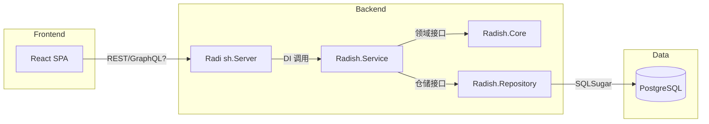

# 开发框架说明

> 本文是 Radish 的“架构与工程实现细节”说明，聚焦：技术栈基线、分层边界、关键中间件/宿主配置、演进与落地约定。
>
> 如果你只想快速建立全局认知，请先读 [架构总览](/architecture/overview)。若你在看当前进度与计划，请跳到 [开发路线图](/development-plan)。前端交互范式与 WebOS 细节见 [前端设计](/frontend/design)。

## 功能期望与范围

- **核心模块**
  - 身份与会话：自建帐号体系、邮箱/用户名登录、JWT + 刷新令牌、角色与权限控制、第三方登录预留。
  - 门户与文档：Radish.Gateway 提供统一对外入口和 `/server` 欢迎页面，并透传健康检查与文档入口；React 单页应用（radish.client）提供业务功能界面；Scalar 嵌入至 API 项目并通过 Gateway `/scalar` 暴露（`/api/docs` 仅保留重定向到 `/scalar` 以兼容旧链接）。
  - 内容域：分类 / 标签 / 帖子 / 评论 / 点赞 / 收藏 / 浏览计数，列表分页与过滤，富文本编辑。
  - 搜索：按标题、标签、分类、作者检索；支持时间/热度排序与模糊匹配（PostgreSQL `tsvector` 预留）。
  - 通知与订阅（可选）：帖子互动提醒、积分变动提醒，支持站内信或邮件。
  - 积分系统：积分账户、积分流水、规则引擎（发帖、互动、被采纳等）。
  - 商城系统：商品、库存、购买/退款、效果激活（头像框、昵称色、签名等）。
  - 管理后台（同 React 工程内实现管理视图）：分类、内容、用户、积分与商城配置。

- **非功能性要求**
  - 安全：所有外部流量通过 Gateway 强制 HTTPS，登录等敏感参数需在前端使用 RSA 公钥加密后发送，后端持私钥解密；结合 JWT + Refresh、基于角色的授权、CSP/CORS、参数验证与敏感信息集中管控。开发阶段 Radish.Api 保留 HTTPS 端口便于直接调试，但在完成 Gateway/OIDC 接入并进入生产环境前，应关闭或限制直接暴露的 API HTTPS 端口，仅通过 Gateway/反向代理对外提供服务。
  - 性能：关键查询 P95 ≤ 200ms；SQLSugar Profile + PostgreSQL EXPLAIN 校验索引；读多写少场景可使用内存缓存。
  - 可用性：健康检查 `/health`, `/ready`; SQLSugar 迁移幂等；容器探针。
  - 可观测性：Serilog 结构化日志、请求跟踪 ID、PostgreSQL 慢查询日志、前端监控埋点。
  - 国际化：后端资源文件（zh-Hans 基线）+ `MessageModel` 三件套，前端 i18n（React i18next），详见 [国际化指南](/architecture/i18n)。
  - 质量：后端 xUnit + Shouldly + NSubstitute，前端 Vitest + RTL，关键链路具备 E2E 冒烟。
  - 配置：`appsettings.{Env}.json` + 环境变量 + `.env`；禁止把密钥写入仓库。

- **里程碑**：参阅 [开发路线图](/development-plan)
  1. M1｜基础设施：解决方案构建、PostgreSQL + SQLSugar 通路、健康检查、React 脚手架跑通。
  2. M2｜领域建模：分类/帖子/评论/用户聚合与仓储、基础 CRUD API。
  3. M3｜应用服务：权限、DTO、业务编排、错误映射与日志规范。
  4. M4｜React MVP：认证、导航、列表/详情/发帖链路、态势监测。
  5. M5｜积分 + 商城：事件驱动积分、商城商品与库存闭环。
  6. M6｜容器与交付：Dockerfile/Compose、自检脚本、CI 验证。

- **范围外 / 边界**
  - 第三方支付、发票、合规认证（GDPR/等保）。
  - 大文件转码与 CDN；多端（小程序/Native App）。
  - 大规模分布式（消息队列、CQRS、多租户），当前阶段聚焦单体 + 水平扩展预留。

## 技术与架构基线

| 领域 | 选型 | 说明 |
| --- | --- | --- |
| 语言/运行时 | C# 13, .NET 10 | `global.json` 锁定 SDK 10.0.0，开启 `Nullable` 与 `ImplicitUsings` |
| Web Host | ASP.NET Core WebApplication | Program.cs 中最小宿主，按需要拆 Controller/Minimal API |
| ORM | [SQLSugar](https://github.com/donet5/SqlSugar) | Code First + Migration，仓储层集中管理上下文，支持读写分离配置 |
| 数据库 | PostgreSQL 16 | 默认端口 5432，连接通过 `ConnectionStrings__Default` 注入 |
| 前端 | React 19 + Vite + TypeScript | radish.client (WebOS)、radish.console (管理控制台)、radish.ui (@radish/ui 组件库)；使用 npm workspaces；建议 React Query + Zustand |
| 前端构建 | Vite Rolldown，ESLint 9，Vitest | 各项目独立构建：radish.client、radish.console、radish.docs (VitePress) |
| 测试 | xUnit 3 + Shouldly + NSubstitute | `Radish.Api.Tests` 目录；后续可按层拆分 |
| 日志 / 配置 | Serilog + `Microsoft.Extensions.Configuration` | 支持 JSON + 环境变量 + 用户密钥；生产日志输出到 Console + Seq/Elastic 预留 |
| 容器 | Dockerfile（Radish.Api）+ Docker Compose | Compose 负责 PostgreSQL + API + 前端静态站点 |

### 本地启动脚本

- `start.ps1`（Windows/PowerShell）与 `start.sh`（Linux/macOS）提供交互式菜单，统一启动/组合 API、Gateway、前端、文档站与控制台等服务。
- 当前菜单大致包含两类选项：
  - **单服务**：仅启动 `Radish.Api` / `Radish.Gateway` / `radish.client`（前端）/ `radish.docs`（文档 dev）/ `radish.console`（控制台）/ `Radish.Auth`，或执行 `Radish.Api.Tests`。
  - **组合启动**：
    - PowerShell (`start.ps1`): 仅保留 "Gateway + Auth + API" 与 "Start ALL"。
    - Shell (`start.sh`): "Gateway + API"、"Gateway + frontend"、"Gateway + docs"、"Gateway + console"、"Gateway + Auth"、"Gateway + Auth + API"、"Start ALL"（编号 9-15）。
- 如需自定义构建配置，可在运行脚本前设置 `Configuration`（PowerShell 参数）或 `CONFIGURATION` 环境变量（Shell 脚本）。

### 分层视图

```
浏览器访问 Gateway (https://localhost:5000)
        │
    统一入口
        ├─→ / (radish.client - WebOS 桌面)
        ├─→ /docs (radish.docs - VitePress)
        ├─→ /console (radish.console - 管理控制台)
        ├─→ /api (Radish.Api - REST API)
        └─→ /scalar (API 文档)

radish.client (WebOS)           radish.console (独立 SPA)
        │                              │
        ├─ 内置应用 (window)            ├─ OIDC 认证
        ├─ 嵌入应用 (iframe)            ├─ 独立路由
        └─ 外部应用 (external)          └─ 管理功能
              │
              └─ Console (新标签页打开)

        共享组件库: @radish/ui

Radish.Api (ASP.NET Core)  ←────── Radish.Gateway
        │                          (YARP 反向代理)
Radish.Service (应用服务)
        │
Radish.Core (领域模型)
        │
Radish.Repository (SQLSugar)
        │
PostgreSQL / SQLite
```

**Phase 0 阶段**：Gateway 仅提供门户页面展示，不参与 API 请求转发
**P1+ 阶段**：Gateway 接管所有外部请求，转发至 Radish.Api 和其他服务

- `Radish.Api`
  - 负责 DI、配置、日志、全局异常、认证授权、Swagger/Scalar、HealthChecks。
  - 仅保留轻量 Controller/Endpoint，所有核心逻辑委派给 Service 层。
  - 配置加载：`ConfigureAppConfiguration` 会先清空默认源，再依次加载 `appsettings.json` 与 `appsettings.{Environment}.json`，保证环境差异（连接串、Snowflake、Redis 等）优先由环境文件覆盖，公共默认值仍写在基础文件里兜底。
  - 雪花 ID：`Program` 在注册 SqlSugar 之后从 `Snowflake` 节读取 `WorkId`、`DataCenterId` 并写入 `SnowFlakeSingle`，多实例部署必须在各自的 `appsettings.{Env}.json` 中配置不同 WorkId；若缺省则读取基础文件的兜底值，禁止把生产与本地设置为同一个编号。
  - 日志：宿主调用 `builder.Host.AddSerilogSetup()`，由 `Radish.Extension.SerilogExtension` 统一配置输出目标。Serilog 默认读取 appsettings，写入控制台与 `Log/` 目录（普通日志 -> `Log.txt`，SqlSugar AOP 日志 -> `AopSql/AopSql.txt`），内部基于 `LogContextTool.LogSource` 区分日志类型并通过 `WriteTo.Async()` 异步落盘，避免阻塞请求线程；业务代码默认直接使用 `Serilog.Log` 静态方法输出日志，仅在依赖外部框架时才注入 `ILogger<T>`。
  - API 文档：开发环境把 Scalar UI 映射到 `/scalar`（`/api/docs` 重定向到 `/scalar`），并通过 `builder.Services.AddOpenApi("v1|v2")` + `options.AddDocument(...)` 维护多版本；如需定制交互，可在 `Radish.Api/wwwroot/scalar/config.js` 中追加 JS 配置并在 `MapScalarApiReference` 中调用 `WithJavaScriptConfiguration`。
  - API 版本控制：采用 **URL 路径版本控制**（`/api/v{version}/[controller]/[action]`），基于 `Asp.Versioning.Mvc` (8.1.0) 实现；Controller 通过 `[ApiVersion("x.0")]` 特性声明版本，未指定版本时默认使用 v1.0。v1 包含核心稳定接口（Login、User），v2 包含新功能与实验接口（AppSetting、RustTest）；OpenAPI 文档通过 `IApiVersionDescriptionProvider` 自动发现所有版本，为每个版本生成独立文档（`/openapi/v1.json`、`/openapi/v2.json`），Scalar UI 提供版本下拉菜单，切换时文档自动过滤只显示对应版本的接口。详细规范见 [开发规范](./specifications.md) 的"API 版本控制规范"章节。
  - 本地调试：`Properties/launchSettings.json` 提供 `http`/`https`（仅启动 API）与 `https+spaproxy`（同时拉起 `radish.client` Vite 服务）两种 Profile，可在 VS/`dotnet run --launch-profile` 间切换作为"联调开关"。
  - 跨域：`appsettings.json` 中的 `Cors:AllowedOrigins` 维护允许访问 API 的前端地址，预设了 `localhost:3000` 以及 Rolldown 默认端口 `58794` 的多个别名（`vite.dev.localhost`、`host.*` 等）。更换端口或外网域名时记得同步更新该列表。
- `Radish.Gateway`
  - **Phase 0 职责**：承载 `/server` 欢迎页面（Razor Pages）、提供基础健康检查透传与文档入口链接，静态资源服务。服务总览与多服务健康状态表已迁移到 Console（`/console`）。
  - **依赖**：复用 `Radish.Common`（配置工具）和 `Radish.Extension`（日志扩展），保持与 `Radish.Api` 一致的配置加载和日志输出方式。
  - **监听端口**：`https://localhost:5000`（主要对外入口）和 `http://localhost:5001`（HTTP 仅用于重定向到 5000）。
  - **健康检查**：自身暴露 `/health`、`/healthz`，下游 `Radish.Api` 健康通过 `/api/health` 统一对外；Console 通过 Gateway 路径 `/`、`/docs`、`/api/health`、`/console` 聚合展示多服务状态。
  - **架构演进**：Phase 0 为简化门户，已实现 YARP 路由转发、统一入口规划等核心功能。详见 [Gateway 服务网关](/guide/gateway)。
- 配置与服务访问：Program.cs 依次调用 `hostingContext.Configuration.ConfigureApplication()` → `builder.ConfigureApplication()` → `app.ConfigureApplication()` → `app.UseApplicationSetup()`，把 Configuration/HostEnvironment/RootServices 注入到 `Radish.Common.Core.App`；在非 DI 管道下可使用 `App.GetService*`、`App.GetOptions*` 手动解析服务或配置。常规字符串读取仍统一使用 `AppSettings.RadishApp("Section", ...)`，批量强类型配置通过 `ConfigurableOptions + AddAllOptionRegister` 自动绑定 `IConfigurableOptions`。
- `Radish.Service`
  - 应用服务（`*AppService`）封装用例流程、权限校验、事务控制、DTO 转换。
  - 依赖 `Radish.Core` 接口与 `Radish.Repository` 实现，通过 `IUnitOfWork` 控制 SQLSugar 上下文。
  - 对外仅返回 DTO/Vo，禁止把 `Radish.Model` 中的实体直接暴露给 Controller；实体需在此层通过 AutoMapper（一律在 `Radish.Extension/AutoMapperSetup` 注册）转换为视图模型。
- `Radish.Core`
  - 聚合根（Post、Comment、Category、UserProfile、PointLedger、ShopItem 等）、值对象、领域事件。
  - 定义仓储接口与领域服务，例如 `IPostRepository`, `IPointPolicyService`。
- `Radish.Repository`
  - 持久化实现，集中 SQLSugar 配置（连接池、AOP 日志、软删除、审计字段）。
  - 提供迁移/种子帮助类，必要时拆分模块级仓储。
  - 仓储层仅依赖实体类型；返回 Service 层的对象必须是实体或匿名结构，禁止引用 DTO/Vo，保持“实体只存在于仓储层”原则。
- `Radish.Model`
  - DTO、ViewModel、查询对象、枚举。
  - 提供 `PagedRequest`, `PagedResponse<T>`, `ApiError` 等复用结构。
  - 视图模型需以 `Vo` 开头，并结合业务含义做缩写/扩写（如 `VoUsrAudit`, `VoAssetReport`），避免简单加前缀即可猜测真实用途。
- `Radish.Extension`
  - 横切关注：验证、缓存策略、OpenAPI 自定义、JWT 扩展、全局过滤器；按照职责拆分 `AutofacExtension/*`, `AutoMapperExtension/*`, `RedisExtension/*` 等子目录。
  - `RedisExtension.CacheSetup` 提供统一入口 `AddCacheSetup()`，根据 `appsettings.json` 的 `Redis.Enable` 自动在 Redis（StackExchange.Redis）与内存缓存间切换，并在启用 Redis 时预先创建 `IConnectionMultiplexer`；缓存读写统一走 `Radish.Common.CacheTool.ICaching` 或 `IRedisBasketRepository`。
  - `SqlSugarExtension.SqlSugarSetup` 负责注入 `ISqlSugarClient` 单例：内部读取 `Radish.Common.DbTool.BaseDbConfig` 生成的连接集合（含 `MainDb`、`Log` 以及所有从库），并在缺失日志库配置时直接抛出异常，确保多库配置在启动阶段即被验证。
- `Radish.Shared`
  - 常量、错误码、事件名、Options 绑定类型，以及跨模块共享的业务枚举（集中位于 `Radish.Shared.CustomEnum` 命名空间，例如 `UserStatusCodeEnum`、`UserSexEnum`、`DepartmentStatusCodeEnum`、`AuthorityScopeKindEnum`、`HttpStatusCodeEnum` 等）。
- `radish.client`
  - SPA + 内嵌管理视图；共享 DTO 通过 `radish.client/src/types` 维护，与后端模型保持同步。
- `UserController -> IUserService -> IUserRepository` 示例链路
  - 通过内存仓储 + 应用服务演示分层合作，Program.cs 负责注入 `IUserService/IUserRepository`。
  - `.http` 文件与 `Radish.Api.Tests/Controllers/UserControllerTest` 均以该示例为基准，确保开发者可以快速验证分层约定。

### 架构示意



## 核心功能模块（MVP）

| 模块 | 后端职责 | 前端职责 |
| --- | --- | --- |
| 帐号与权限 | 用户、角色、权限、JWT/刷新令牌、密码策略、邮箱验证、登录日志 | 登录/注册/忘记密码，角色控制菜单，Session 续期提示 |
| 分类/标签 | 聚合建模、层级/顺序维护、缓存/快照、只读列表接口 | 分类导航、筛选器、管理表单 |
| 帖子/评论 | CRUD、全文搜索预留、交互指标累加、幂等处理 | 列表、详情、编辑器、Markdown/富文本、骨架屏 |
| 点赞/收藏 | 多表事务（帖子计数 + 用户关系）、幂等 API | 双态按钮、Lazy Update、错误回滚 |
| 积分 | 规则配置、事件订阅（发帖、点赞、被采纳）、流水记录、积分账户锁定 | 积分面板、历史记录、规则展示 |
| 商城 | 商品/库存/价格、购买/退款/激活、权益发放、过期策略 | 商品列表/详情、购买流程、权益展示、我的物品 |
| 管理视图 | 统一权限守卫、数据导出、批量操作、操作日志 | React Admin Layout、表格与筛选、审计信息 |

## 实时交互（SignalR）

- 场景：帖子评论/点赞即时刷新、在线用户状态、积分变化提示、运营公告推送等需要“秒级到达”体验的功能统一通过 SignalR Hub 承载，避免重复造轮子。
- 架构：`Radish.Api` 内新增 `Hubs/*Hub.cs` 定义 strongly-typed Hub；业务层通过注入 `IHubContext<T>` 推送消息，或在 Service 内调度事件。客户端由 `radish.client` 使用 `@microsoft/signalr` SDK 建立连接，统一封装 `useSignalrHub` Hook。
- 协议：默认使用 JSON over WebSocket，自动降级为 Server-Sent Events/Long Polling；如需 Binary 可切换 MessagePack，需在前后端同时开启。
- 安全：连接时附带 JWT/AccessToken，服务端在 `OnConnectedAsync` 中验证身份与租户；Hub Method 名称使用 PascalCase 并在共享 DTO 中定义负载，禁止随意拼字符串。
- 扩展：多实例部署时启用 Redis Backplane（`Microsoft.AspNetCore.SignalR.StackExchangeRedis`）保持消息一致性；对公网推送需配置 TLS 与速率限制，可在 Nginx/Ingress 层结合 IP 限流。

## 数据与持久化策略

- SQLSugar 统一由 `SqlSugarScope` 单例提供，`Radish.Common.DbTool.BaseDbConfig.MutiConnectionString` 负责解析 `appsettings.json` 的 `MainDb` 与 `Databases` 列表并生成所有连接配置。默认示例包含 `Main`（业务库）与 `Log`（日志库）两个 SQLite 文件，可扩展到 PostgreSQL/MySQL 等；若缺少 `Log` 库会在启动阶段直接抛出异常。
- `SqlSugarExtension.SqlSugarSetup` 会为日志库之外的所有连接注册到 `BaseDbConfig.ValidConfig`，并将 `SqlSugarConst.Log` 标记的配置注入日志上下文；SqlSugar 内部缓存通过 `SqlSugarCache` 委托给现有 `ICaching`，AOP 事件统一写入 Serilog，便于分析 SQL。
- 公共实体基类统一继承 `Radish.Model.Root.RootEntityTKey<TKey>`，并在派生类中补充审计字段（`CreatedAt/By`, `UpdatedAt/By`, `IsDeleted`, `ConcurrencyStamp` 等），保证主键类型可控且能被 SqlSugar 的 Attribute 正确识别。
- 软删除通过 SQLSugar Filter 全局开启；必要时在仓储层提供 `IncludeDeleted` 选项。
- 迁移策略：
  - 开发：`db.DbMaintenance.CreateDatabase()` + `InitTables()`。
  - 生产：通过 `Radish.Repository.Migrations` 导出 SQL 或在部署阶段运行迁移命令。
- 数据初始化：`SeedRunner` 负责创建默认分类、管理员、积分规则。
- PostgreSQL 特性利用：JSONB 列（存储自定义配置）、`tsvector` 搜索、行级锁（积分/库存扣减）。

## 前端架构与规范

- 详细的前端设计、桌面/移动交互规范与未来 React Native 规划均见 [前端设计](/frontend/design)，下文仅保留核心约束。
- Vite 配置 HTTPS、代理 API、环境变量区分（`.env.development` / `.env.production`），并在 `radish.client` 中启用 React 19 + Rolldown。
- 目录建议：`app/`（入口、providers、路由）、`features/*`（按业务拆包）、`widgets/*`（桌面组件）、`shared/*`（api/ui/config），保持与未来 RN 工程一致，方便共享包。
- 认证：封装 API 客户端自动附带 Token，失效触发刷新；敏感数据统一通过 RSA 公钥加密。
- 状态管理：TanStack Query 管理异步数据与缓存，Zustand 管理 Dock/窗口/主题等客户端状态，表单由 React Hook Form + Zod 验证。
- UI 与可访问性：Tailwind/UnoCSS + 自研组件 + Framer Motion 动效，兼顾键盘/触屏；所有文案走 i18n。
- 组件库：计划自研一套基础组件（Button/Input/Select/Checkbox/Radio/Switch/Transfer/Form 等），或在 antd、Arco 等库上做白标二次封装，封装层统一输出 API、主题 Token、交互规范与 Storybook 文档，供桌面/移动/RN 共享。推荐参考 [Uiverse Galaxy](https://github.com/uiverse-io/galaxy)（3500+ 社区驱动的开源 UI 组件，支持 CSS/Tailwind，MIT 许可）寻找设计灵感和参考实现。
- 桌面化交互规范：桌面 Shell + Dock + 窗口系统为核心体验，移动端自动切换至 Tab/Stack 结构；未来 React Native/Expo 应重用相同的 Design Token 与组件语义。
- 测试：组件级 Vitest + React Testing Library，端到端走 Playwright（桌面/移动视口），RN 规划阶段可使用 Detox。

## DevOps 与运维基线

1. **配置与密钥**：
   - `appsettings.json` 仅放默认值，环境差异通过 `appsettings.{Env}.json` + 环境变量。
   - 本地秘密写入 `dotnet user-secrets` 或 `.env.local`（被 .gitignore 忽略）。
2. **日志与监控**：
   - Serilog 写入 Console + File；在容器中输出 JSON 便于收集。
   - 预留 OpenTelemetry Exporter 与 Prometheus 指标。
3. **部署流水线**：
   - Dockerfile 使用多阶段构建（Restore → Build → Publish）。
   - Compose 负责 PostgreSQL + API + 反向代理（如 Caddy/Nginx），可扩展加上前端静态站点。
   - 生产部署建议挂载 `appsettings.Production.json` 与证书目录，使用 `ConnectionStrings__Default` 环境变量。
4. **质量门禁**：
   - PR 必须附带 `dotnet test` 与 `npm run build` 结果；若变更数据库需提供迁移脚本与回滚建议。
   - 关键模块需要 Code Review + Pair Walkthrough。

## API Gateway 规划（已完成 Phase 0）

- **当前状态**：Gateway 项目已完成 Phase 0 实施，实现了服务门户、YARP 路由转发、健康检查聚合等核心功能。
- **Phase 0 成果**：实现关注点分离，API 项目专注于提供接口服务，Gateway 承担统一入口和路由转发职责。
- **技术实现**：使用 YARP (Yet Another Reverse Proxy) 实现反向代理，支持 API、Auth、Docs、Console 等服务的路由转发。
- **详细文档**：完整的架构说明、配置指南、部署方案见 [Gateway 服务网关](/guide/gateway)。
- 新增服务/接口需要在 Gateway 配置中添加相应的路由规则，确保统一入口访问。

---

如需在架构或选型上做进一步调整，请同步更新本文件并在 DevelopmentLog 中记录决策，确保贡献者获取到一致的信息。
